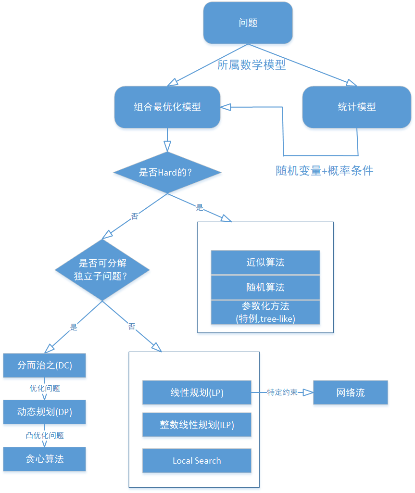

## 算法学习总结

### 基本数据结构
- 翻转字符串：head和tail，swap值，head和tail逐渐向中间靠拢。
- S,T是否字母异位词，即各个字母的数量相同：简单用map存储数量，因为可能的字母总数有限，可以直接用一个26位的数组来代替map.
- 一个数组，滑动窗口每次只向右移动一位，获取窗口中最大的数字：可以用双端队列保留还有用的数字：如果一个数字，他的右边比他小，则还有用；如果右边比他大，则只要保留右边的就行了，自身已经没用了，可以去掉。就是说，一个数字入列时，可以干掉比他小的数字。

### 高级数据结构
https://blog.csdn.net/Small_Orange_glory/article/details/81290634
https://www.jianshu.com/p/7cd5ad2f449a
- 分段树，区间树（线段树）:能够以O(lgn)求解数组的区间[i,j]的和的数据结构。结构上类似三叉搜索树，节点上保留的是节点范围内的某种统计数据。比如，总和、个数等，特定的统计数据可以解决特定的问题。使用节点来构成一颗线段树。

- 树状数组:可以表示区间树形状的数组：在线段树的基础上，去掉不需要的节点，最终缩减为两个数组，就可以实现区间树求解一个区间[i,j]的和的功能。
区别：区间树是一颗树，用节点来实现的，而树状数组是用数组实现的。

- 单词树(前缀树，字典树，Trie;又称单词查找树)

### 算法设计思想

### 算法分析
1. 迭代算法分析：时间复杂度就是将每层循环的长度相乘
2. 递归算法分析：写出递归公式T(n) = a×T(n/b) + f(n)，然后迭代展开，看是否能够得到时间复杂度。如果不能，利用以下规则：
	- 当递归部分的执行时间n^log(b)a大于f(n)的时候，最终的时间复杂度就是O(n^logba)。
	- 当递归部分的执行时间n^log(b)a小于f(n)的时候，最终的时间复杂度就是 f(n)。
	- 当递归部分的执行时间 n^log(b)a 等于 f(n) 的时候，最终的时间复杂度就是 O(n^logba)logn。
