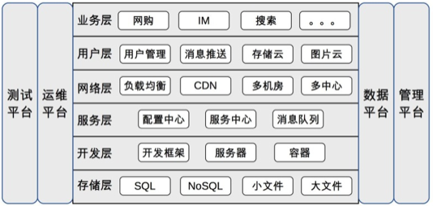

## 从0开始学架构

### 架构定义
软件架构指软件系统的顶层结构
架构是顶层设计；框架是面向编程或配置的半成品；组件是从技术维度上的复用；模块是从业务维度上职责的划分；系统是相互协同可运行的实体。

为了解决软件系统越来越庞大而带来的复杂性，科学家们尝试了以下方法：
结构化程序设计方法 -> 面向对象的思想 -> 软件架构
“模块”,“对象”,“组件”本质上都是对达到一定规模的软件进行拆分，差别只是在于随着软件的复杂度不断增加，拆分的粒度越来越粗，拆分的层次越来越高。

### 架构设计的目的
架构设计的主要目的是为了解决软件系统复杂度带来的问题。
系统复杂度的来源：
- 高性能：
- 高可用：难点是一致性
- 可扩展性:2个方法：将“变化”封装在一个“变化层”，将不变的部分封装在一个独立的“稳定层”;提炼出一个“抽象层”和一个“实现层”
- 成本、安全和规模：

### 架构设计的原则
- 合适原则: “合适优于业界领先”
- 简单原则: “简单优于复杂”
- 演化原则: “演化优于一步到位”

考虑到软件架构需要根据业务发展不断变化这个本质特点，软件架构设计其实更加类似于大自然“设计”一个生物，通过演化让生物适应环境，逐步变得更加强大.

### 架构设计流程
1. 识别复杂度:“高性能”“高可用”“可扩展”等
2. 设计备选方案
3. 评估和选择备选方案:列出我们需要关注的质量属性点，然后分别从这些质量属性的维度去评估每个方案，再综合挑选适合当时情况的最优方案。
4. 详细方案设计

### 高性能架构模式
1. 读写分离
解决主从复制延迟有几种常见的方法：
	- 写操作后的读操作指定发给数据库主服务器
	- 读从机失败后再读一次主机
	- 关键业务读写操作全部指向主机，非关键业务采用读写分离

2. 分库分表
3. NoSQL:
	- K-V 存储：解决关系数据库无法存储数据结构的问题，以 Redis 为代表。
	- 文档数据库：解决关系数据库强 schema 约束的问题，以 MongoDB 为代表。
	- 列式数据库：解决关系数据库大数据场景下的 I/O 问题，以 HBase 为代表。
	- 全文搜索引擎：解决关系数据库的全文搜索性能问题，以 Elasticsearch 为代表。
4. 缓存的架构设计要点:
	- 缓存穿透:不存在的情况也设置kv，布隆过滤器
	- 缓存雪崩:当缓存失效（过期）后引起系统性能急剧下降的情况.解决方法：更新锁机制和后台更新机制，双key策略：要缓存的key过期时间是t，key1没有过期时间。
	- 缓存热点：复制多份缓存副本，将请求分散到多个缓存服务器上，减轻缓存热点导致的单台缓存服务器压力。

### 高可用架构模式
1. CAP:在一个分布式系统（指互相连接并共享数据的节点的集合）中，当涉及读写操作时，只能保证一致性（Consistence）、可用性（Availability）、分区容错性（Partition Tolerance）三者中的两个，另外一个必须被牺牲。

Memcache 的集群，相互之间就没有连接和共享数据，因此 Memcache 集群这类分布式系统就不符合 CAP 理论探讨的对象.
ZooKeeper 的选举机制，不是读写操作，就不是 CAP 探讨的对象。

CAP 关注的粒度是数据，而不是整个系统
BASE 是指基本可用（Basically Available）、软状态（ Soft State）、最终一致性（ Eventual Consistency），核心思想是即使无法做到强一致性（CAP 的一致性就是强一致性），但应用可以采用适合的方式达到最终一致性。
BASE 理论本质上是对 CAP 的延伸和补充，更具体地说，是对 CAP 中 AP 方案的一个补充。
ACID 是数据库管理系统为了保证事务的正确性而提出来的一个理论。

综合上面的分析，ACID 是数据库事务完整性的理论，CAP 是分布式系统设计理论，BASE 是 CAP 理论中 AP 方案的延伸。

2. 主备复制,双机切换
3. 数据集群和数据分区
4. 异地多活架构
5. 降级,熔断,限流(排队)

### 可扩展性架构模式
可扩展性架构的设计方法很多，但万变不离其宗，所有的可扩展性架构设计，背后的基本思想都可以总结为一个字：拆。
拆，就是将原本大一统的系统拆分成多个规模小的部分，扩展时只修改其中一部分即可，无须整个系统到处都改，通过这种方式来减少改动范围，降低改动风险。

- 面向流程拆分：分层架构。分层架构的优势就体现在通过分层强制约束两两依赖，一旦自由选择绕过分层，时间一长，架构就会变得混乱。
- 面向服务拆分：SOA、微服务。
- 面向功能拆分：微内核架构。微内核架构（Microkernel Architecture），也被称为插件化架构（Plug-in Architecture），是一种面向功能进行拆分的可扩展性架构，通常用于实现基于产品的应用。例如 Eclipse 这类 IDE 软件、UNIX 这类操作系统、淘宝 App 这类客户端软件等。微内核架构包含两类组件：核心系统（core system）和插件模块（plug-in modules）

### 架构重构内功心法
- 有的放矢：架构师的首要任务是从一大堆纷繁复杂的问题中识别出真正要通过架构重构来解决的问题，集中力量快速解决，而不是想着通过架构重构来解决所有的问题。
- 合纵连横：做好各方面的沟通
- 运筹帷幄：将要解决的问题根据优先级、重要性、实施难度等划分为不同的阶段，每个阶段聚焦于一个整体的目标，集中精力和资源解决一类问题。