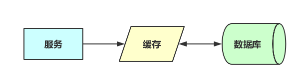
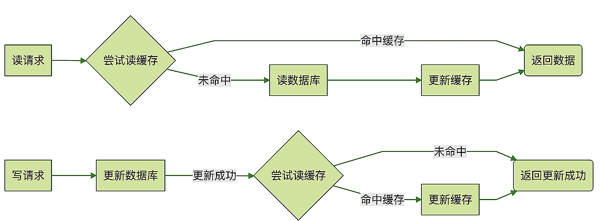

## 后端存储学习总结

凡是那些特别难解决的、让你付出巨大代价的，或者是损失惨重的技术问题，几乎都可以归为存储系统的问题。

存储是系统中最核心、最重要、最关键的组成部分，没有之一。

业务需求最关键的两个问题：
- 这个系统（或者是功能）是给哪些人用的？
- 这些人使用这个系统来解决什么问题？

mysql主键是递增的一个重要原因：
如果主键是随机的话，可能会导致很多页分裂。

OSS对象存储其实就是一个无限容量的大文件 KV 存储。
它的存储单位是对象，其实就是文件，可以是一张图片，一个视频，也可以是其他任何文件。每个对象都有一个唯一的 key，利用这个 key 就可以随时访问对应的对象。基本的功能就是写入、访问和删除对象。

典型的商品系统的存储：

幂等性的实现方法：
- 加版本号，更新时同时加上版本号相等的条件

分布式事务
- 2PC:
	如果准备阶段成功，进入提交阶段，这个时候就“只有华山一条路”，整个分布式事务只能成功，不能失败。
- 3PC:
	3PC相比于2PC做了两个改进，一是事务执行器也增加了超时机制，避免我们课程中提到的因为协调者宕机，导致执行器长时间卡死的问题，另外，3PC在2PC之前增加一个询问阶段，这个阶段事务执行器可以去尝试锁定资源（但不等待），这样避免像2PC那样直接去锁定资源，而资源不可用的情况下，一直等待资源而卡住事务的情况。
- TCC:Try,Confirm,Cannel
- Saga:直接就是Confirm和Cannel，没有Try的过程。
- 本地消息表: 
	实现简单，在单机事务的基础上稍加改造就可以实现分布式事务，另外，本地消息表的性能非常好，和单机事务的性能几乎没有差别。在这个基础上，还提供了大部分情况下都能接受的“数据最终一致性”的保证，所以，本地消息表是更加实用的分布式事务实现方法。
- rocketmq的事务消息

### 阿里的canel&otter实现数据同步:
https://blog.csdn.net/liupeifeng3514/article/details/79687130
基于canal&otter的复制技术和mysql复制类似，具有类比性：
- Canal对应于I/O thread，接收Master Binary Log；
- Otter对应于SQL thread，通过Canal获取Binary Log数据，执行同步插入数据库；

### 缓存更新策略
- Read/Write Through(通读缓存):代理缓存、反向代理缓存、CDN 缓存，操作系统的page cache都是通读缓存。它代理了用户的请求，也就是说用户在访问数据的时候，总是要通过通读缓存。
	
- Cache Aside(旁路缓存):和通读缓存相对应的叫作旁路缓存。
	

### 面向对象六大原则
SOLID:
- 单一职责原则（SRP：Single responsibility principle）
- 开闭原则（OCP：Open Closed Principle）
- 里氏替换原则(LSP：Liskov Substitution Principle)
- 接口隔离原则（ISP：Interface Segregation Principle）
- 依赖倒置原则（DIP：Dependence Inversion Principle）
	这种方法也称为“面向接口编程”。它的核心思想是，调用方不应依赖于具体实现，而是为实现定义一个接口，让调用方和实现都依赖于这个接口。要解耦调用方和实现类，还需要解决一个问题：谁来创建实现类的实例？
	使用 Spring 的依赖注入是可以解决的,即IoC容器。
	这里再给你介绍一种 Java 语言内置的，更轻量级的解决方案：SPI（Service Provider Interface）。
- 最少知识原则（Least Knowledge Principle 简写LKP）,也叫迪米特法则（Law of Demeter）

### 原生分布式存储系统面临的共同问题：
- 有一个集群来保存元数据 (Metadata)，如zk，etcd等：集群的节点信息、文件信息和它们的映射关系。这些为了管理集群而存储的数据，叫做元数据 (Metadata)。元数据对于一个存储集群来说是非常。
- 存储集群为了对外提供访问服务，还需要一个网关集群，对外接收外部请求，对内访问元数据和数据节点。网关集群中的每个节点不需要保存任何数据，都是无状态的节点。有些对象存储没有网关，取而代之的是客户端，它们的功能和作用都是一样的。

对象存储是最简单的分布式存储系统，主要由数据节点集群、元数据集群和网关集群（或者客户端）三部分构成。数据节点集群负责保存对象数据，元数据集群负责保存集群的元数据，网关集群和客户端对外提供简单的访问 API，对内访问元数据和数据节点读写数据。
为了便于维护和管理，大的对象被拆分为若干固定大小的块儿，块儿又被封装到容器（也就分片）中，每个容器有一主 N 从多个副本，这些副本再被分散到集群的数据节点上保存。

### 海量数据应该如何存储?
- 使用 Kafka 存储海量原始数据
- 使用 HDFS 来存储
- 时序数据库（Time Series Databases）,如InfluxDB。它们专注于类似监控数据这样，有时间特征并且数据内容都是数值的数据。

### 海量数据，如何才能查得更快?
- MySQL：数据量在 GB 量级以下的选择。
- 列式数据库，比如：HBase、Cassandra、ClickHouse，这些产品对海量数据，都有非常好的查询性能。
- Elasticsearch（ES），ES 本来是一个为了搜索而生的存储产品，但是也支持结构化数据的存储和查询。
- HDFS:数据量级超过 TB 级的时候，一般都选择保存在 HDFS 中，配合 Map-Reduce、Spark、Hive 等等这些大数据生态圈产品做数据聚合和计算。

转变你的思想：根据查询来选择存储系统。存储系统没有银弹，不要指望简单地更换一种数据库，就可以解决数据量大，查询慢的问题。
对于海量数据来说，选择存储系统没有银弹，重要的是转变思想，根据业务对数据的查询方式，反推数据应该使用什么存储系统、如何分片，以及如何组织。即使是同样一份数据，也要根据不同的查询需求，组织成不同的数据结构，存放在适合的存储系统中，才能在每一种业务中都达到理想的查询性能。