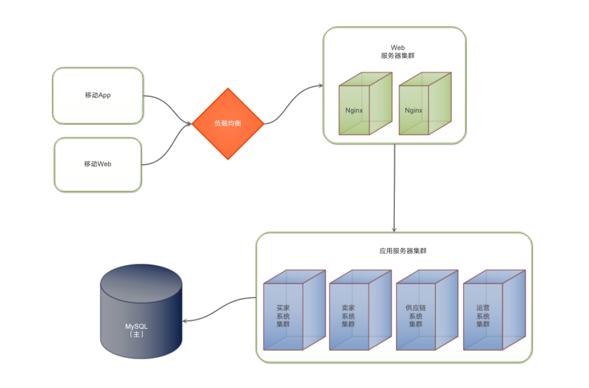
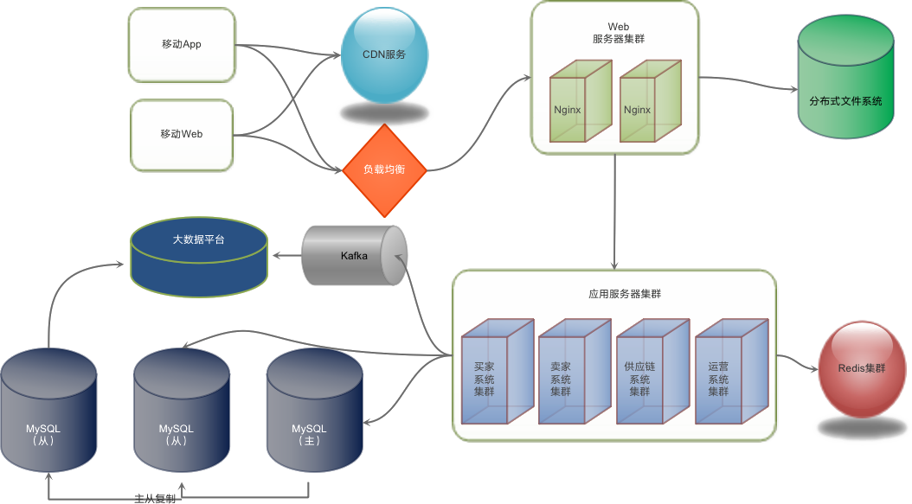
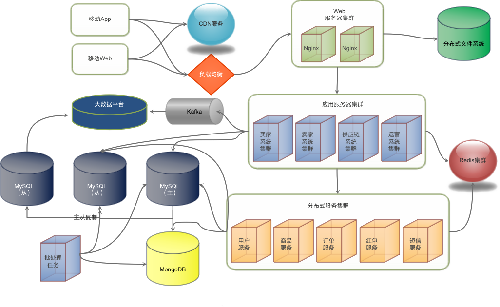

## 架构学习总结

### 大型互联网系统的特点

- 高并发和大流量
- 高可用
- 海量的数据存储
- 用户分布广泛，网络情况复杂
- 安全环境恶劣
- 需求变化快，发布频繁

### 架构三板斧
- 集群
- 缓存：反向代理缓存、 CDN 缓存和对象缓存
- 消息队列 
计算机的整个体系结构中缓存几乎是无处不在的

### 缓存的类型
- 通读缓存：代理缓存、反向代理缓存、CDN 缓存，都是通读缓存。它代理了用户的请求，也就是说用户在访问数据的时候，总是要通过通读缓存。
- 旁路缓存：和通读缓存相对应的叫作旁路缓存。前面提到的 key、value 这样的对象缓存就属于旁路缓存。

### 消息队列 
分布式消息队列异步架构的好处：
- 业务逻辑解耦，系统易于开发和维护
- 异步处理实现快速响应；
- 高并发访问压力的时削峰填谷，减轻访问高峰的系统负载压力；
- 消费者易于伸缩；
- 隔离失败任务，消费者处理任务失败，不会影响主业务流程；

消息队列的挑战：
- 消息无序：按业务要求把需要有序的数据发到同一个分区
- 消息重复：消费方设计成幂等性
- 消息丢失：分区有备份

### 微服务
跟其他技术不同，微服务具有强业务属性，业务如果本身结构混乱，目标不清晰，仓促使用微服务，可能会使整个系统变得更加复杂和难以控制。所以在使用微服务前，最重要的是要先明确自己的需求：我们到底想用微服务达到什么样的目的？需求清晰了，再去考虑具体的方案和技术。这也是使用大多数技术的时候应有的方法和思路。

所以进行微服务架构设计之初，就要先做好业务模块的设计和规划。同时，对于那些业务耦合比较严重、逻辑复杂多变的系统，进行微服务重构的时候，也要特别谨慎。如果做不好模块的划分和耦合管理。那么，宁可晚一点进行微服务架构重构，也不要仓促上马，以免最后带来巨大的损失。

使用微服务最重要的是做好业务的模块化设计，模块之间要低耦合，高聚合，模块之间的依赖关系要清晰简单。只有这样的模块化设计，才能够构建出良好的微服务架构。如果系统本身就是一团遭，强行将它们拆分在不同的微服务里，只会使系统变得更加混乱。

命令与查询职责隔离（CQRS）
这种模式在服务接口层面将查询操作（也就是读操作）和命令操作（也就是写操作）隔离开来，在服务层实现读写分离。我们知道在读操作中主要使用的优化方式是缓存操作。那么，我们可以将接口层面的查询操作即读操作，尽量多地通过缓存来返回。而写操作也就是命令操作，主要的性能优化方式是使用消息队列。那么，我们可以将数据的更新操作，尽量通过消息队列，通过异步化的方式进行处理，以改善性能。

### 高性能：
吞吐量 = 并发数/响应时间

吞吐量指标：TPS 是每秒事务数，QPS 是每秒查询数来表示。总之，就是单位时间内处理的请求数目。

- 最上层的优化是硬件优化，包括骨干网络、数据中心服务器硬件这样的优化；
- 然后是基础组件的性能优化，包括操作系统、虚拟机、应用中间件这几个方面；
- 这之后才是架构的优化，包括核心的三板斧：缓存、异步和集群；
- 最后才是代码的优化，代码优化的主要手段，有并发、复用、异步以及正确的数据结构，当然最重要的是设计清晰、易维护、易懂、简单、灵活的代码，也就是说最重要的是要遵循面向对象的设计原则和设计模式进行编程。

### 高可用
- 负载均衡：DNS，HTTP，IP层，数据链路层（返回响应直接发给客户端）
- 数据库复制与失效转移：主主复制和主从复制结合
- 消息队列隔离
- 限流、熔断和降级
- 异地多活机房架构
- 高可用运维：自动化测试、自动化监控、预发布、灰度发布

### 安全架构设计

Web 攻击与防护:
- XSS 攻击(跨站点脚本攻击)：消毒（检查参数）、HttpOnly
- SQL 注入攻击：消毒、参数绑定
- CSRF 攻击（跨站点请求伪造）：表单 Token、验证码

大部分的攻击都可以在请求和响应阶段进行拦截处理，所以不用每个程序自己去独立处理。在应用网关或者在请求接入的时候，可以设置一个统一的 Web 应用防火墙，对所有的请求响应进行拦截处理。如ModSecurity 。

### 案例
- 第一步：

- 第二步：

- 第三步：
