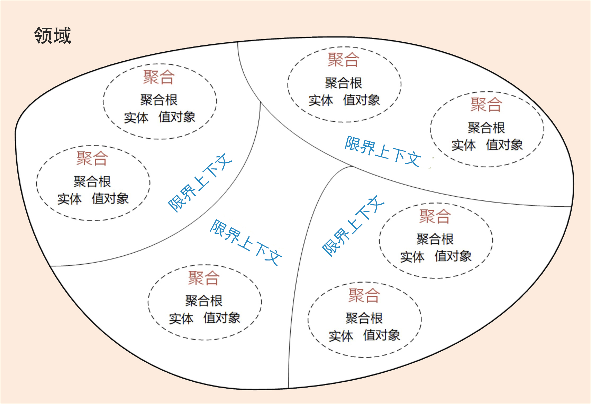
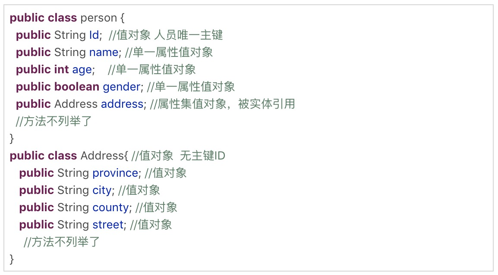

## DDD实战课总结

### DDD和微服务设计的关系
DDD 包括战略设计和战术设计两部分。
- 战略设计主要从业务视角出发，建立业务领域模型，划分领域边界，建立通用语言的限界上下文，限界上下文可以作为微服务设计的参考边界。
- 战术设计则从技术视角出发，侧重于领域模型的技术实现，完成软件开发和落地，包括：聚合根、实体、值对象、领域服务、应用服务和资源库等代码逻辑的设计和实现。

### DDD中各种域的理解
- 领域就是用来确定范围的，范围即边界，这也是 DDD 在设计中不断强调边界的原因。简言之，DDD 的领域就是这个边界内要解决的业务问题域。
- 领域可以进一步划分为子领域。我们把划分出来的多个子领域称为子域，每个子域对应一个更小的问题域或更小的业务范围。
在领域不断划分的过程中，领域会细分为不同的子域，子域可以根据自身重要性和功能属性划分为三类子域，它们分别是：核心域、通用域和支撑域。
- 决定产品和公司核心竞争力的子域是核心域，它是业务成功的主要因素和公司的核心竞争力。
- 没有太多个性化的诉求，同时被多个子域使用的通用功能子域是通用域。
- 还有一种功能子域是必需的，但既不包含决定产品和公司核心竞争力的功能，也不包含通用功能的子域，它就是支撑域。

领域建模和微服务建设的过程和方法基本类似，其核心思想就是将问题域逐步分解，降低业务理解和系统实现的复杂度。
领域的核心思想就是将问题域逐级细分，来降低业务理解和系统实现的复杂度。通过领域细分，逐步缩小微服务需要解决的问题域，构建合适的领域模型，而领域模型映射成系统就是微服务了。

### 限界上下文
对同样的领域知识，不同的参与角色可能会有不同的理解，那大家交流起来就会有障碍，怎么办呢？因此，在 DDD 中就出现了“通用语言”和“限界上下文”这两个重要的概念。
这两者相辅相成，通用语言定义上下文含义，限界上下文则定义领域边界，以确保每个上下文含义在它特定的边界内都具有唯一的含义，领域模型则存在于这个边界之内。
- 在事件风暴过程中，通过团队交流达成共识的，能够简单、清晰、准确描述业务涵义和规则的语言就是通用语言。也就是说，通用语言是团队统一的语言，不管你在团队中承担什么角色，在同一个领域的软件生命周期里都使用统一的语言进行交流。
通用语言的价值也就很明了，它可以解决交流障碍这个问题，使领域专家和开发人员能够协同合作，从而确保业务需求的正确表达。
- 限界上下文的定义就是：用来封装通用语言和领域对象，提供上下文环境，保证在领域之内的一些术语、业务相关对象等（通用语言）有一个确切的含义，没有二义性。这个边界定义了模型的适用范围，使团队所有成员能够明确地知道什么应该在模型中实现，什么不应该在模型中实现。
理论上限界上下文就是微服务的边界。我们将限界上下文内的领域模型映射到微服务，就完成了从问题域到软件的解决方案。
可以说，限界上下文是微服务设计和拆分的主要依据。在领域模型中，如果不考虑技术异构、团队沟通等其它外部因素，一个限界上下文理论上就可以设计为一个微服务。
子域的划分是一个业务粗分过程。而限界上下文这个设计过程是一个详细的领域建模和微服务设计过程。可以把限界上下文理解成一个子域。
如果领域太大，你不方便进行分析和设计。子域划分的主要目的就是为了将领域的问题空间缩小，以方便你下一步进行详细的领域建模和微服务设计，而这个过程是一个非常细致的过程。限界上下文实际上也是一种分析后得出的子域。
所以有了这两个阶段。

DDD 分析和设计过程中的每一个环节都需要保证限界上下文内术语的统一，在代码模型设计的时侯就要建立领域对象和代码对象的一一映射，从而保证业务模型和代码模型的一致，实现业务语言与代码语言的统一。

### 实体和值对象
在 DDD 中有这样一类对象，它们拥有唯一标识符，且标识符在历经各种状态变更后仍能保持一致。我们把这样的对象称为实体。在 DDD 不同的设计过程中，实体的形态是不同的:
- 实体的业务形态:
在战略设计时，实体是领域模型的一个重要对象。领域模型中的实体是多个属性、操作或行为的载体。
- 实体的代码形态:
按照一定的业务规则将依存度高和业务关联紧密的多个实体对象和值对象进行聚类，形成聚合。你可以这么理解，实体和值对象是组成领域模型的基础单元。
在 DDD 里，这些实体类通常采用充血模型，与这个实体相关的所有业务逻辑都在实体类的方法中实现，跨多个实体的领域逻辑则在领域服务中实现。
- 实体的运行形态:
实体以 DO（领域对象）的形式存在，每个实体对象都有唯一的 ID。
- 实体的数据库形态:
与传统数据模型设计优先不同，DDD 是先构建领域模型，针对实际业务场景构建实体对象和行为，再将实体对象映射到数据持久化对象。

在 DDD 中用来描述领域的特定方面，并且是一个没有标识符的对象，叫作值对象。值对象描述了领域中的一件东西，这个东西是不可变的，它将不同的相关属性组合成了一个概念整体。
- 值对象的业务形态:
本质上，实体是看得到、摸得着的实实在在的业务对象，实体具有业务属性、业务行为和业务逻辑。而值对象只是若干个属性的集合，只有数据初始化操作和有限的不涉及修改数据的行为，基本不包含业务逻辑。值对象的属性集虽然在物理上独立出来了，但在逻辑上它仍然是实体属性的一部分，用于描述实体的特征。
- 值对象的代码形态:
值对象在代码中有这样两种形态。如果值对象是单一属性，则直接定义为实体类的属性；如果值对象是属性集合，则把它设计为 Class 类，Class 将具有整体概念的多个属性归集到属性集合，这样的值对象没有 ID，会被实体整体引用。

- 值对象的运行形态:
采用属性嵌入的方式嵌入;采用序列化大对象的方式嵌入
- 值对象的数据库形态:
DDD 引入值对象是希望实现从“数据建模为中心”向“领域建模为中心”转变，减少数据库表的数量和表与表之间复杂的依赖关系，尽可能地简化数据库设计，提升数据库性能。
值对象就是通过这种方式，简化了数据库设计，总结一下就是：在领域建模时，我们可以将部分对象设计为值对象，保留对象的业务涵义，同时又减少了实体的数量；在数据建模时，我们可以将值对象嵌入实体，减少实体表的数量，简化数据库设计。

实体和值对象是微服务底层的最基础的对象，一起实现实体最基本的核心领域逻辑。

### 聚合和聚合根
在事件风暴中，我们会根据一些业务操作和行为找出实体（Entity）或值对象（ValueObject），进而将业务关联紧密的实体和值对象进行组合，构成聚合，再根据业务语义将多个聚合划定到同一个限界上下文（Bounded Context）中，并在限界上下文内完成领域建模。
在 DDD 中，实体和值对象是很基础的领域对象。实体一般对应业务对象，它具有业务属性和业务行为；而值对象主要是属性集合，对实体的状态和特征进行描述。但实体和值对象都只是个体化的对象，它们的行为表现出来的是个体的能力。
领域模型内的实体和值对象就好比个体，而能让实体和值对象协同工作的组织就是聚合，它用来确保这些领域对象在实现共同的业务逻辑时，能保证数据的一致性。
聚合就是由业务和逻辑紧密关联的实体和值对象组合而成的，聚合是数据修改和持久化的基本单元，每一个聚合对应一个仓储，实现数据的持久化。

聚合在 DDD 分层架构里属于领域层，领域层包含了多个聚合，共同实现核心业务逻辑。聚合内实体以充血模型实现个体业务能力，以及业务逻辑的高内聚。跨多个实体的业务逻辑通过领域服务来实现，跨多个聚合的业务逻辑通过应用服务来实现。

如果把聚合比作组织，那聚合根就是这个组织的负责人。聚合根也称为根实体，它不仅是实体，还是聚合的管理者。

DDD 领域建模通常采用事件风暴，它通常采用用例分析、场景分析和用户旅程分析等方法，通过头脑风暴列出所有可能的业务行为和事件，然后找出产生这些行为的领域对象，并梳理领域对象之间的关系，找出聚合根，找出与聚合根业务紧密关联的实体和值对象，再将聚合根、实体和值对象组合，构建聚合。

《实现领域驱动设计》一书中的聚合设计原则:
1. 在一致性边界内建模真正的不变条件。
2. 设计小聚合。
3. 通过唯一标识引用其它聚合。
4. 在边界之外使用最终一致性。
5. 通过应用层实现跨聚合的服务调用。

聚合的特点：高内聚、低耦合，它是领域模型中最底层的边界，可以作为拆分微服务的最小单位，但我不建议你对微服务过度拆分。但在对性能有极致要求的场景中，聚合可以独立作为一个微服务，以满足版本的高频发布和极致的弹性伸缩能力。

聚合根的特点：聚合根是实体，有实体的特点，具有全局唯一标识，有独立的生命周期。一个聚合只有一个聚合根，聚合根在聚合内对实体和值对象采用直接对象引用的方式进行组织和协调，聚合根与聚合根之间通过 ID 关联的方式实现聚合之间的协同。

实体的特点：有 ID 标识，通过 ID 判断相等性，ID 在聚合内唯一即可。状态可变，它依附于聚合根，其生命周期由聚合根管理。实体一般会持久化，但与数据库持久化对象不一定是一对一的关系。实体可以引用聚合内的聚合根、实体和值对象。

值对象的特点：无 ID，不可变，无生命周期，用完即扔。值对象之间通过属性值判断相等性。它的核心本质是值，是一组概念完整的属性组成的集合，用于描述实体的状态和特征。值对象尽量只引用值对象。

### 事件风暴
事件风暴是一项团队活动，领域专家与项目团队通过头脑风暴的形式，罗列出领域中所有的领域事件，整合之后形成最终的领域事件集合，然后对每一个事件，标注出导致该事件的命令，再为每一个事件标注出命令发起方的角色。命令可以是用户发起，也可以是第三方系统调用或者定时器触发等，最后对事件进行分类，整理出实体、聚合、聚合根以及限界上下文。