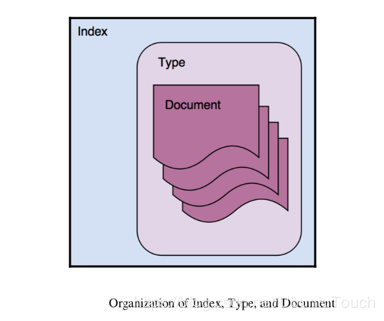
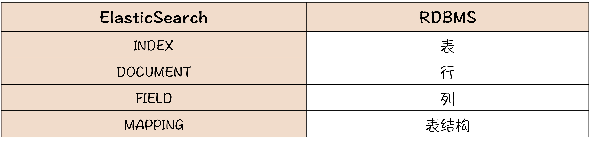
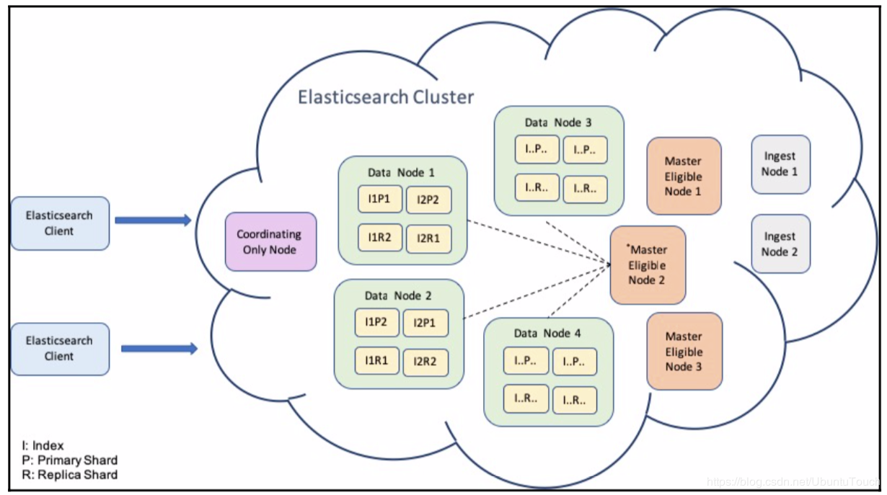
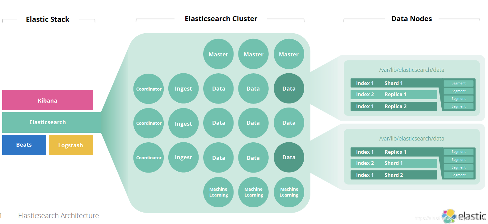
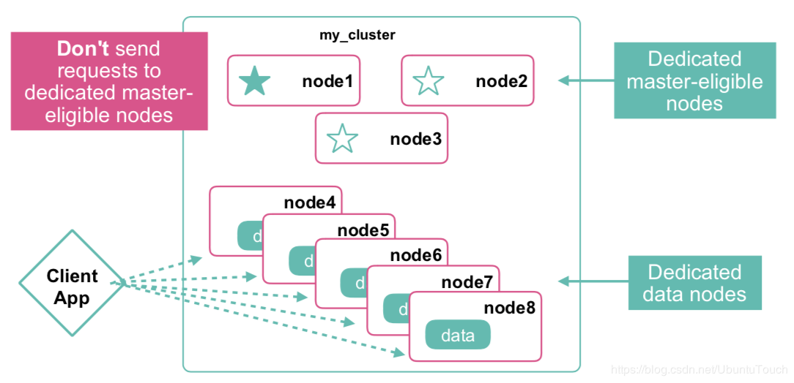
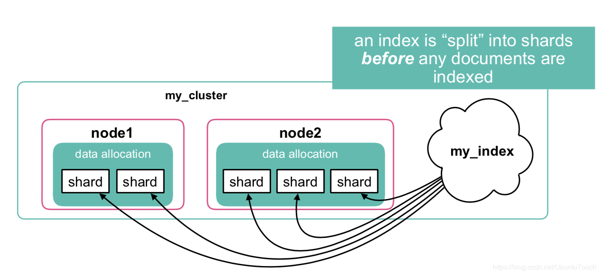
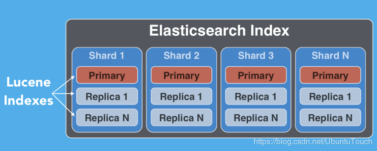

## elasticsearch学习总结

### 一. es是什么？
es是一个支持全文搜索的、面向文档的数据库（搜索引擎）。es是分布式的，天然支持水平扩展。可以作为mysql的一个补充，解决mysql不支持全文搜索，不易扩展的问题。

### 二. es的数据结构
es的逻辑数据结构如下：  index -> type -> document，所以 _index、_type、_id三者唯一确定一个文档。文档在es中是不可变的，无法修改。那我们如何更新文档呢？在更新已存在的文档时，我们重建（reindex）索引，并把_version加一。



其中，type的概念在lucene层面并没有对应的概念，容易引起混乱，所以在6.X之后一个index只能包含一个type，以后的版本会移除掉type的概念。
所以，es和关系型数据库的概念对应关系为：


es的api就是对index/document的数据结构进行CRUD的操作，有支持http的RESTapi，以及支持socket的TransportClient҅。


### 三. 分布式集群架构
es的分布式架构为：clster <--> node,即一个集群包含多个节点。
es集群就像是下面的一个布局：


es的一个node可以在集群中担任多种角色，具体的角色类型如下：
- master:管理集群
- data:保存数据
- coordinator:处理请求，查询还有取回。
- ingest:数据索引前的预处理
- machine learning:机器学习

其中作为coordinator角色的节点处理请求可分为两个阶段：查询，取回
1. 查询，把请求分解到各个数据节点做查询，把各个节点的返回结果做一个归并排序算法，得出需要的document id列表。
2. 取回，根据document id列表取回document本身。

es的分布式架构如下图所示,



### 四. index和shard的关系
一个index是一个逻辑命名空间，它映射到一个或多个主分片，并且可以具有零个或多个副本分片。**其中主分片数在index定义时就固定了，无法修改；而replica的数目是可以动态修改的**。
其中，文档到主分片的路由算法很简单：**hash(_routing) % primary_shard_hum**
一个shard分片是一个最小级别的"工作单元",就是一个lucene实例，并且它本身就是一个完整的搜索引擎。

es的复制策略replication有两种:sync(同步),asyn(异步)
而同步策略consistency有：one(一个主分片),all(主分片+所有复制分片),quorum或过半。
文档的复制并不是在复制分片上执行更新，而是转发整个文档的新版本到复制分片。

index和shard的关系如下面两张图所示：




### 五. es和lucene字段的关系：
es的底层实现为lucene。一个es索引包含很多分片，一个分片就是一个lucene的索引，它本身就是一个完整的搜索引擎，可以独立执行建立索引和搜索任务。
es中的字段可以大致分为两种：确切值和全文文本，这两种最终都会转化为lucene的term（term是lucene索引的最小单位）：
1. 如果field的类型为全文索引，则此字段会分词为多个term。
2. 如果field的类型为确切值，则此字段的内容就是一个term。

我们通过_mappings设置字段的类型（确切值或全文索引），index参数可以控制字符串以何种方式被索引：
1. analyzed:全文索引
2. not_analyzed:可以索引，但不分词，即精确值
3. no:不索引，即不能被搜索到。
text类型（string）默认是analyzed，其他的默认是not_analyzed或no的。

lucene是一种扁平化的结构，并不能支持支持复杂的json结构，那么json中的内部对象和对象数组是如何被lucene索引的呢？
1. 内部对象会被转化为kv形式的扁平结构，如 {"name.firstName":"mike"}.
2. 对象数组也会被扁平化，转为 kv形式，其中v为数组形式，如
```
{
	{"收件人.address":["地址1","地址2"]}，
	{"收件人.phone":["电话1","电话2"]}
}
```
这样，其实会丢掉地址和电话之间的对应关系的。

### 六. RESTApi和查询DSL介绍
大致可以把RESTUrl分为两类：
1. 运维类的url：用来查看整个集群的健康、节点、索引总体情况。主要以_cat开头，如 _cat/nodes,_cat/indices,_cat/health.
2. 索引操作类的url：用来对索引进行CRUD。url以索引名（_typeName为可选）开头，后面可接_search、_mappings来做不同的操作。
小结：以下单词会以_开头：动词（_cat,_search等），有特别规定含义的名词（_all,_doc等）。其他的一般不易_开头。
_all：当es索引一个文档时，会把所有的字符串连成一个大的字符串，然后索引为名为_all的特殊字段。

DSL查询语言用到的符号可大致分为两种：
1. 逻辑符号（bool,must,must_not,should），相当于 and,or,not等逻辑符号。
2. 运算符（term,match,range,exists）,相当于 =,>,<,存在等运算符。
DSL的查询体大致就是用逻辑符号把各种运算符链接起来，实现复杂的逻辑运算。

特别注意的两点：
1. 当 must和should同时使用时，should不生效。（注意must_not和should同时使用时,should是生效的）。解决方法有两种，可以把表达式展开，使其不要同时含must和should；或者在should之后加上mininum_should_match:1的参数。
2. term和match的区别：term不对输入的搜索词进行分词，把整个搜索词进行检索，如果此字段是全文搜索的话，则进行全文搜索；而match会对输入的搜索词进行分词。**特别注意：term并不是精确值搜索，而仅仅是不对输入的搜索词进行分词而已。**

restapi中各方法的作用：
- put:创建index，或者新增document【url带id】
- post:新增document【url不带id】
- get:查询并返回数据
- head:检查是否存在，不返回具体数据
- delete:删除索引或者document

### 七. 其他重要问题。
1. ik中文分词的两种模式的区别：
	- ik_smart:根据词库最粗粒度分词
	- ik_max_word:根据词库最细粒度分词。
2. 深分页的解决：深分页对性能有较大影响，可以采用以下两种来解决：
	- 使用滚动查询来代替(scroll)，只能上一页，下一页，而且有时间限制。
	- 假如有一个递增并唯一的字段，则可以把分页转化为对这个字段的范围查询。
3. mysql主库的数据如何同步到es库中，如何保证一致性？
对于这些问题，阿里已经有了开源解决方案canal，架构图如下：
4. es如何进行1-N关联？
	- nested嵌套文档：即把一篇文章+所有评论作为一个文档，用类型为nested的字段把评论列表作为内嵌文档。
	- parent-child父子文档 ：把文章作为一个文档，评论作为一个文档，用类型为join的字段建立了两者的父子关系。