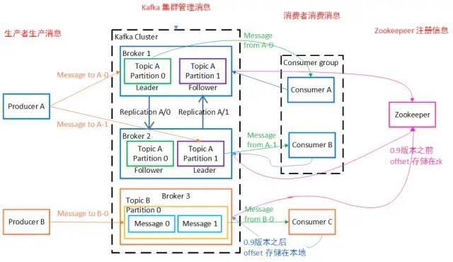
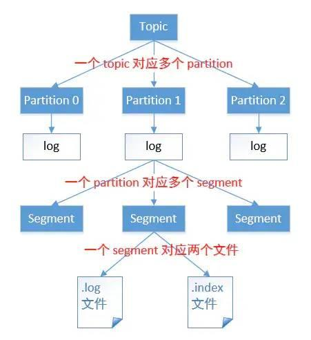
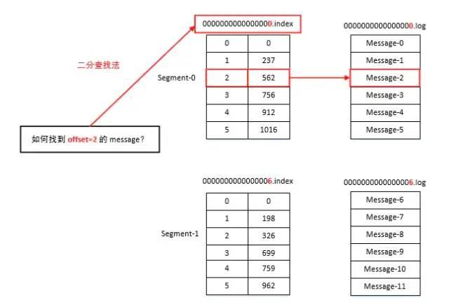
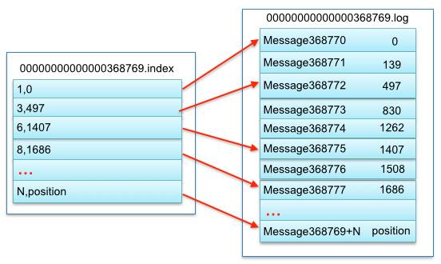
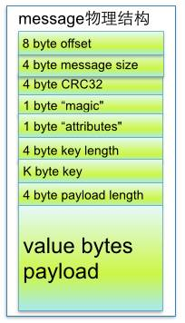
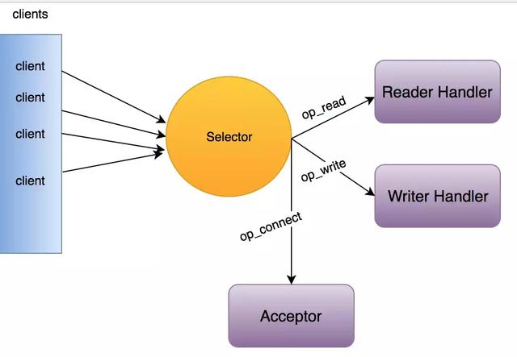
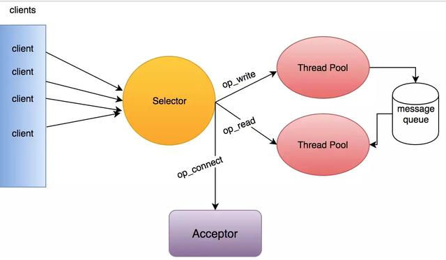

## kafka学习总结

### 一. kafka是什么？
kafka是一款基于发布与订阅的分布式消息系统。相比一般的消息系统，kafka支持多个生产者，多个消费者，基于磁盘的数据存储可以让消费者离线维护一段时间而不会丢失消息。kafka作为一个分布式系统，有很强的伸缩性、高性能和高可用。
整体架构图如下：

### 二. kafka的数据结构
kafka把消息保存在文件中，我们把分区分成若干个片段，默认情况下，每个片段包含1G或一周的数据，以较小的那个为准。在broker往分区写入数据时，如果达到片段上线，就关闭当前文件，并打开一个新文件。当前正在写入的片段叫活跃片段，活跃片段永远不会被删除。
消息包含键，值，偏移量，消息大小，校验和，消息格式版本号，压缩算法和时间戳。
为了让消费者可以从任意偏移量开始读消息，broker为每个分区维护了一个索引，索引把偏移量映射到片段文件和偏移量在文件的位置。

 
### 三. 数据库的持久化

### 三. 客户端-服务器通信模型

KafkaClient --单线程Selector

单线程模式适使用于并发链接数小，逻辑简单，数据量小。

在kafka中，consumer和producer都是用的上面的单线程模式。这种模式不适合kafka的服务端，在服务端中请求解决过程比较复杂，会造成线程阻塞，一旦出现后续请求就会无法解决，会造成大量请求超时，引起雪崩。而在服务器中应该充分利使用多线程来解决执行逻辑。

Kafka--server -- 多线程Selector

### 三. 分布式集群架构
acks:控制需要多少个partition写入成功才返回。
顺序保证：保证同一个分区的消息是有序的

kafka通过zookeeper的/controller临时节点来选举控制器（master），控制器负责在节点加入或者离开集群时进行分区首领选举。控制器使用epoch（类似raft中的term）来避免“脑裂”，即防止两个节点同时认为自己是当前的控制器，只有新的epoch才有效，旧的epoch无效。

每个分区都有一个首领副本，为保证一致性，所有生产者和消费者的请求都会经过这个副本。跟随者副本不处理客户端的请求，他们的唯一任务就是从首领哪里复制消息，保持与首领一致的状态，如果首领发生崩溃，其中的一个跟随者会被提升为新首领。
这个任务分工和redis是一样的，slave不会接受客户端的请求。而es为了提供性能，副本分片也处理请求，但是只有主分片才能处理索引请求.

客户端自己负责把请求发送到首领副本所在的服务器，如果发送错误，服务器会返回错误。客户端是如何知道这些信息的呢？客户端可以向任意一个broker发送元数据请求，响应信息包括主题包含的分区及副本，哪个是首领副本，哪些是复制副本。客户端会缓存这些元数据，并负责更新。
kafka使用零拷贝技术向客户端发送消息：直接把消息从文件发送到网络通道，而不经过任何中间缓冲区。这是kafka和其他大部分数据库系统不一样而地方，避免了字节复制，也不需要管理内存缓冲区，从而获得更好的性能。

新版本的kafka不再使用zookeeper来保存偏移量，而是把偏移量保存在特定的kafka主题上。zookeeper是保存broker信息和controller信息。

kafka的可靠性保证：
- kafka保证分区消息的顺序
- 只有当消息被写入分区的所有同步副本时，消息太被任务是“已提交的”。生产者可以选择接收不同类型的确认。
- 消费者只能读取已经提交的消息
- 只要还有一个副本时活跃的，那么已经提交的消息就不会丢失。

kafka的复制机制和分区的多副本架构师kafka可靠性保证的核心。
ack=all表示所有的同步副本都接收到消息才返回成功，注意，这里是“同步副本”，即那些与首领副本之间几乎是零延迟的副本。为了防止只有首领副本是同步副本时，首领副本所在的broker崩溃导致丢失消息的问题，可以设置最少同步副本，即只有同步副本的数量达到这个数，才能够写入成功。

### 六. api介绍
一个消费者群组消费一个或多个主题的所有消息，群组内的每个消费者只消费一部分消息（一个或多个分区）
一个发送者可以发送到一个主题的多个分区，依赖于具体的分区逻辑。

### 七. redis的其他用法。

### 七. 其他重要问题。

