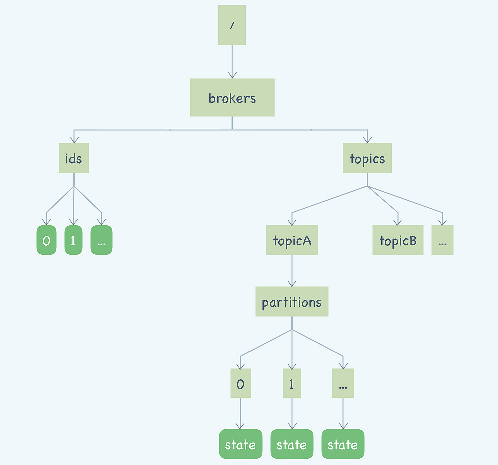
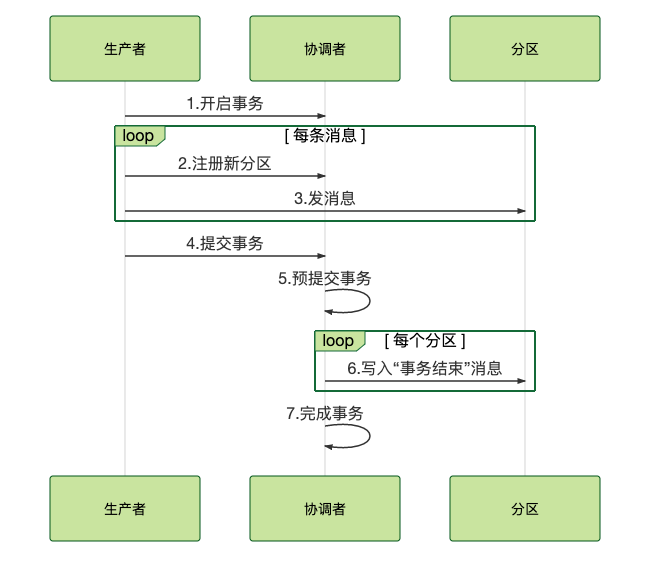

## 消息队列高手课

### 消息队列的使用场景
消息队列最常被使用的三种场景：
- 异步处理
- 流量控制(削峰填谷)
- 服务解耦

当然，消息队列的适用范围不仅仅局限于这些场景，还有包括：
- 作为发布 / 订阅系统实现一个微服务级系统间的观察者模式；
- 连接流计算任务和数据；
- 用于将消息广播给大量接收者。

简单的说，我们在单体应用里面需要用队列解决的问题，在分布式系统中大多都可以用消息队列来解决。

弊端：
- 增加系统的复杂度
- 降低了数据一致性
- 可能会丢消息、可能会重复消费消息、可能导致数据不一致、消息可能是无序的

### 消息队列的选型
如果说，消息队列并不是你将要构建系统的主角之一，你对消息队列功能和性能都没有很高的要求，只需要一个开箱即用易于维护的产品，我建议你使用 RabbitMQ。
如果你的系统使用消息队列主要场景是处理在线业务，比如在交易系统中用消息队列传递订单，那 RocketMQ 的低延迟和金融级的稳定性是你需要的。
如果你需要处理海量的消息，像收集日志、监控信息或是前端的埋点这类数据，或是你的应用场景大量使用了大数据、流计算相关的开源产品，那 Kafka 是最适合你的消息队列。

选择中间件的考量维度：可靠性，性能，功能，可运维行，可拓展性，是否开源及社区活跃度
rabbitmq：
优点：轻量，迅捷，容易部署和使用，拥有灵活的路由配置
缺点：性能和吞吐量较差，不易进行二次开发
rocketmq：
优点：性能好，稳定可靠，有活跃的中文社区，特点响应快
缺点：兼容性较差，但随着影响力的扩大，该问题会有改善
kafka：
优点：拥有强大的性能及吞吐量，兼容性很好
缺点：由于“攒一波再处理”导致延迟比较高
pulsar：
采用存储和计算分离的设计，是消息队里产品中黑马，值得持续关注

### 消息模型
rabbitmq采用的是队列模型，利用Exchange 将消息发送到多个队列，实现多个消费者

rocketmq和kafka采用的是标准的发布-订阅模型,RocketMQ 也有队列（Queue）这个概念,每个主题包含多个队列，通过多个队列来实现多实例并行生产和消费。

Kafka 的消息模型和 RocketMQ 是完全一样的，但是kafka中是没有队列这个概念的，Kafka 中对应的名称是“分区（Partition）”，含义和功能和rocketmq的队列是没有任何区别的。

### 如何利用事务消息实现分布式事务?

如果图中的第四步提交事务消息时失败了怎么办？
Kafka 的解决方案比较简单粗暴，直接抛出异常，让用户自行处理。我们可以在业务代码中反复重试提交，直到提交成功，或者删除之前创建的订单进行补偿。RocketMQ 则给出了另外一种解决方案。
RocketMQ 的事务反查机制，这种机制通过定期反查事务状态，来补偿提交事务消息可能出现的通信失败。

### 如何确保消息不会丢失?
- 生产阶段：编写发送消息代码时，需要注意，正确处理返回值或者捕获异常，就可以保证这个阶段的消息不会丢失。
- 存储阶段：你可以通过配置刷盘和复制相关的参数，让消息写入到多个副本的磁盘上，来确保消息不会因为某个 Broker 宕机或者磁盘损坏而丢失。
- 消费阶段：你需要在处理完全部消费业务逻辑之后，再发送消费确认。

### 如何处理消费过程中的重复消息?
MQTT 协议中，给出了三种传递消息时能够提供的服务质量标准，这三种服务质量从低到高依次是：
- At most once: 至多一次
- At least once: 至少一次
- Exactly once：恰好一次
我们现在常用的绝大部分消息队列提供的服务质量都是 At least once，包括 RocketMQ、RabbitMQ 和 Kafka 都是这样。也就是说，消息队列很难保证消息不重复。

一个幂等操作的特点是，其任意多次执行所产生的影响均与一次执行的影响相同。
从对系统的影响结果来说：At least once + 幂等消费 = Exactly once。

设计幂等操作的方法：
- 利用数据库的唯一约束实现幂等，或者用 Redis 的 SETNX 命令来替代数据库中的唯一约束，来实现幂等消费。
- 为更新的数据设置前置条件，更加通用的方法是，给你的数据增加一个版本号属性，每次更数据前，比较当前数据的版本号是否和消息中的版本号一致，如果不一致就拒绝更新数据，更新数据的同时将版本号 +1，一样可以实现幂等更新。
- 记录并检查操作：执行数据更新操作之前，先检查一下是否执行过这个更新操作。“检查消费状态，然后更新数据并且设置消费状态”中，三个操作必须作为一组操作保证原子性，才能真正实现幂等，否则就会出现 Bug。对于这个问题，当然我们可以用事务来实现，也可以用锁来实现，但是在分布式系统中，无论是分布式事务还是分布式锁都是比较难解决问题。

### 如何读源码？
如果你想了解一个开源项目，学习它的代码，最佳的切入点就是去读它的官方文档，这些文档里面，最重要的灵魂就是项目背后的那篇论文，它一般是这个开源项目的理论基础。
在阅读源码的时候呢，最佳的方式是带着问题去阅读，**最好是带着问题的答案去读**，这样难度低、周期短、收获快。不要想着一定要从总体上去全面掌握一个项目的所有源代码，也没有必要。

官方文档->灵魂->带着问题&答案找实现->核心类结构图，流程图、时序图、文字描述
随着越来越多问题的解决，由点成线，由线成网。

### 如何使用异步编程模型？
使用异步编程模型，虽然并不能加快程序本身的速度，但可以减少或者避免线程等待，只用很少的线程就可以达到超高的吞吐能力。
简单实用的异步框架: CompletableFuture,返回值为CompletableFuture<T>,然后调用CompletableFuture.thenCompose(lambda);即可实现异步编程。底层是通过ForkJoinPool实现的。

### 传输协议：应用程序之间对话的语言
- 用分隔符断句：比如 HTTP1 协议，它的分隔符是换行（\r\n），缺点是需要转义
- 前置长度：在每段前面加个长度。

### kafka为什么有那么高的性能？
- 使用批量消息提升服务端处理能力
	构建批消息和解开批消息分别在发送端和消费端的客户端完成，不仅减轻了 Broker 的压力，最重要的是减少了 Broker 处理请求的次数，提升了总体的处理能力。
- 使用顺序读写提升磁盘 IO 性能
	它的存储设计非常简单，对于每个分区，它把从 Producer 收到的消息，顺序地写入对应的 log 文件中，一个文件写满了，就开启一个新的文件这样顺序写下去。消费的时候，也是从某个全局的位置开始，也就是某一个 log 文件中的某个位置开始，顺序地把消息读出来。这样一个简单的设计，充分利用了顺序读写这个特性，极大提升了 Kafka 在使用磁盘时的 IO 性能。
- 利用 PageCache 加速消息读写
	Kafka 在读写消息文件的时候，充分利用了 PageCache 的特性。一般来说，消息刚刚写入到服务端就会被消费，按照 LRU 的“优先清除最近最少使用的页”这种策略，读取的时候，对于这种刚刚写入的 PageCache，命中的几率会非常高。
- ZeroCopy：在消费过程中,使用零拷贝技术
	直接从 PageCache 中把数据复制到 Socket 缓冲区中，这样不仅减少一次数据复制，更重要的是，由于不用把数据复制到用户内存空间，DMA 控制器可以直接完成数据复制，不需要 CPU 参与，速度更快。
	所谓的零拷贝，Linux的系统调用是sendfile，在java中对应的方法是FileChannel.transferTo。ByteBuffer.allocateDirect(capacity)这里的直接缓冲区是不是零拷贝技术，这只是使用堆外内存。

### LRU的变种
- LRU-K:K代表最近使用的次数，因此LRU可以认为是LRU-1。LRU-K的主要目的是为了解决LRU算法“缓存污染”的问题，其核心思想是将“最近使用过1次”的判断标准扩展为“最近使用过K次”。
- LRU-2Q:类似LRU-2。Two queues，一个FIFO队列，一个LRU队列，被访问了先进入FIFO队列，再次访问进入LRU队列。FIFO和LRU按照自己的规则淘汰对象。
- mysql_lru改进：分为两部分：young（热数据）和old（冷数据），处于LRU_OLD里的数据页，每次访问时都需要判断一下，如果该数据页在LRU链表中存在时间超过1s，就将其移动到young的链表头部。防止一次性的大查询读取的数据页污染整个LRU列表,影响整体的事务命中率

### 如何避免死锁？
- 再次强调一下，避免滥用锁，程序里用的锁少，写出死锁 Bug 的几率自然就低。
- 对于同一把锁，加锁和解锁必须要放在同一个方法中，这样一次加锁对应一次解锁，代码清晰简单，便于分析问题。
- 尽量避免在持有一把锁的情况下，去获取另外一把锁，就是要尽量避免同时持有多把锁。
- 如果需要持有多把锁，一定要注意加解锁的顺序，解锁的顺序要和加锁顺序相反。比如，获取三把锁的顺序是 A、B、C，释放锁的顺序必须是 C、B、A。
- 给你程序中所有的锁排一个顺序，在所有需要加锁的地方，按照同样的顺序加解锁。比如我刚刚举的那个例子，如果两个线程都按照先获取 lockA 再获取 lockB 的顺序加锁，就不会产生死锁。

### 硬件同步原语
- CAS:Compare And Set
- FAA:Fetch And Add：i=i+a的原子性实现

### Kafka和RocketMQ的消息复制实现的差异点在哪？
RocketMQ的主从关系是通过配置固定的，不能动态切换。如果主节点宕机，则生产者不能再生产消息，当时之前的消息都已经存到磁盘了。等主节点恢复之后，未复制的消息依然可以复制到从节点，所以即使主节点宕机，也不会丢消息（除非磁盘坏了）。从设计上来讲，RocketMQ 的这种主从复制方式，牺牲了可用性，换取了比较好的性能和数据一致性。
新版的Dledger 在写入消息的时候，要求至少消息复制到半数以上的节点之后，才给客户端返回写入成功，并且它是支持通过选举来动态切换主节点的。

Kafka 的 Broker 是不分主从的。分区的多个副本中也是采用一主多从的方式。Kafka 在写入消息的时候，采用的也是异步复制的方式。消息在写入到主节点之后，并不会马上返回写入成功，而是等待足够多的节点都复制成功后再返回。在 Kafka 中这个“足够多”是多少呢？Kafka 的设计哲学是，让用户自己来决定。Kafka 为这个“足够多”创造了一个专有名词：ISR（In Sync Replicas)，翻译过来就是“保持数据同步的副本”。ISR 的数量是可配的，但需要注意的是，这个 ISR 中是包含主节点的。
Kafka 使用 ZooKeeper 来监控每个分区的多个节点，如果发现某个分区的主节点宕机了，Kafka 会利用 ZooKeeper 来选出一个新的主节点，这样解决了可用性的问题。

### RocketMQ的集群主从管理
展开来讲，不仅仅是 RocketMQ，任何一个弹性分布式集群，都需要一个类似于 NameServer 服务，来帮助访问集群的客户端寻找集群中的节点，这个服务一般称为 NamingService。比如，像 Dubbo 这种 RPC 框架，它的注册中心就承担了 NamingService 的职责。在 Flink 中，则是 JobManager 承担了 NamingService 的职责。也就是说，这种使用 NamingService 服务来协调集群的设计，在分布式集群的架构设计中，是一种非常通用的方法。

在 RocketMQ 中，NameServer 是一个独立的进程，为 Broker、生产者和消费者提供服务。NameServer 最主要的功能就是，为客户端提供寻址服务，协助客户端找到主题对应的 Broker 地址。此外，NameServer 还负责监控每个 Broker 的存活状态。
NameServer 支持只部署一个节点，也支持部署多个节点组成一个集群，这样可以避免单点故障。在集群模式下，NameServer 各节点之间是不需要任何通信的，也不会通过任何方式互相感知，每个节点都可以独立提供全部服务。

多个NameServer之间不通讯，相互独立，是AP的设计思想，可用性高，缺点是没法保证多个NameServer的数据一致性。

### kafka的集群管理
Kafka 却采用了完全不同的设计思路，它选择使用 ZooKeeper 这样一个分布式协调服务来实现和 RocketMQ 的 NameServer 差不多的功能。

ZooKeeper 最核心的功能是，它提供了一个分布式的存储系统，数据的组织方式类似于 UNIX 文件系统的树形结构。由于这是一个可以保证一致性的存储系统，所以你可以放心地在你的应用集群中读写 ZooKeeper 的数据，而不用担心数据一致性的问题。分布式系统中一些需要整个集群所有节点都访问的元数据，比如集群节点信息、公共配置信息等，特别适合保存在 ZooKeeper 中。

kafka 的客户端并不会去直接连接 ZooKeeper，它只会和 Broker 进行远程通信，那我们可以合理推测一下，ZooKeeper 上的元数据应该是通过 Broker 中转给每个客户端的。
Kafka 在每个 Broker 中都维护了一份和 ZooKeeper 中一样的元数据缓存，并不是每次客户端请求元数据就去读一次 ZooKeeper。由于 ZooKeeper 提供了 Watcher 这种监控机制，Kafka 可以感知到 ZooKeeper 中的元数据变化，从而及时更新 Broker 中的元数据缓存。

Znode 节点类型：
- PERSISTENT 持久化节点
- PERSISTENT_SEQUENTIAL 持久顺序节点：这类节点的基本特性和上面的节点类型是一致的。额外的特性是，此节点的名字后面有数字来代表顺序。
- EPHEMERAL 临时节点：和持久节点不同的是，临时节点的生命周期和客户端会 话绑定。
- EPHEMERAL_SEQUENTIAL 临时自动编号节点：此节点是属于临时节点，不过带有顺序，客户端会话结束节点就消失。

### Rocketmq和kafka的事务的不同：
Kafka 的事务解决的问题和 RocketMQ 是不太一样的。RocketMQ 中的事务，它解决的问题是，确保执行本地事务和发消息这两个操作，要么都成功，要么都失败。并且，RocketMQ 增加了一个事务反查的机制，来尽量提高事务执行的成功率和数据一致性。
而 Kafka 中的事务，它解决的问题是，确保在一个事务中发送的多条消息，要么都成功，要么都失败。

总结一下 Kafka 这个两阶段的流程，准备阶段，生产者发消息给协调者开启事务，然后消息发送到每个分区上。提交阶段，生产者发消息给协调者提交事务，协调者给每个分区发一条“事务结束”的消息，完成分布式事务提交。

Kafka 中的 Exactly Once 又是解决的什么问题呢？它解决的是，在流计算中，用 Kafka 作为数据源，并且将计算结果保存到 Kafka 这种场景下，数据从 Kafka 的某个主题中消费，在计算集群中计算，再把计算结果保存在 Kafka 的其他主题中。这样的过程中，保证每条消息都被恰好计算一次，确保计算结果正确。

### 计算与存储分离的设计:Pulsar
什么是存储计算分离呢？顾名思义，就是将系统的存储职责和计算职责分离开，存储节点只负责数据存储，而计算节点只负责计算，也就是执行业务逻辑。这样一种设计，称为存储计算分离。存储计算分离设计并不新鲜，它的应用其实是非常广泛的。
比如说，所有的大数据系统，包括 Map Reduce 这种传统的批量计算，和现在比较流行的 Spark、Flink 这种流计算，它们都采用的存储计算分离设计。数据保存在 HDFS 中，也就是说 HDFS 负责存储，而负责计算的节点，无论是用 YARN 调度还是 Kubernetes 调度，都只负责“读取 - 计算 - 写入”这样一种通用的计算逻辑，不保存任何数据。
更普遍的，我们每天都在开发的各种 Web 应用和微服务应用，绝大多数也采用的是存储计算分离的设计。数据保存在数据库中，微服务节点只负责响应请求，执行业务逻辑。也就是说，数据库负责存储，微服务节点负责计算。

### rocketmq和kafka的选主
kafka的选主（Controller）：抢占模式：Broker 在启动后，都会尝试在 ZooKeeper 中创建同一个临时节点：/controller，并把自身的信息写入到这个节点中。
RocketMQ/Dledger 的选举，在 Dledger 中的 Leader 真的是通过投票选举出来的，所以它不需要借助于任何外部的系统，Dledger 采用的是Raft 一致性算法。

### 为什么大部分mq没有使用存储和计算分离的设计？
早期的消息队列，主要被用来在系统之间异步交换数据，大部分消息队列的存储能力都比较弱，不支持消息持久化，不提倡在消息队列中堆积大量的消息，这个时期的消息队列，本质上是一个数据的管道。
现代的消息队列，功能上看似没有太多变化，依然是收发消息，但是用途更加广泛，数据被持久化到磁盘中，大多数消息队列具备了强大的消息堆积能力，只要磁盘空间足够，可以存储无限量的消息，而且不会影响生产和消费的性能。这些消息队列，本质上已经演变成为分布式的存储系统。

### Dubbo 这类 RPC 框架是如何来实现调用远程服务的？
