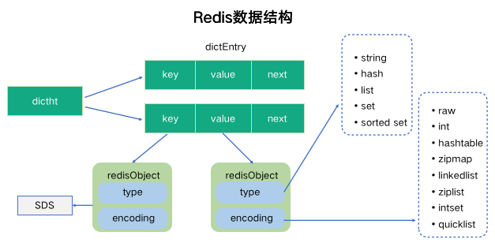
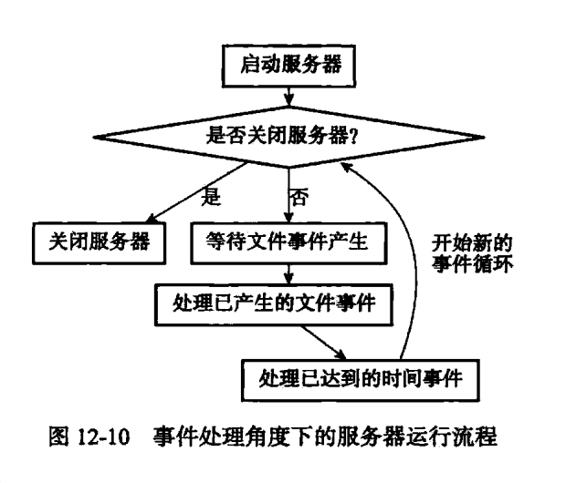
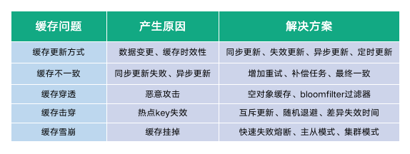

## redis学习总结

### 一. redis是什么？
redis是一个支持分布式的，面向kv结构的内存数据库。可以作为mysql的一个补充，缓存一些不经常变化的数据。
官方定义：Redis是一个开源的、基于内存的数据结构存储器，可以用作数据库、缓存和消息中间件。

### 二. es的数据结构

redis的值的类型有：STRING(字符串)，LIST(列表)，SET(集合)，HASH(散列表)，ZSET(有序集合)

redis的数据结构的实现：
- 字符串使用SDS（simple dynamic string）：增加了size和free冗余，提前分配更多的内存，使得字符串变化时执行更少操作。同时使得有些操作O(1),如取长度。
- dict字典结构，和java一样，使用数组+链表的方式实现。不过redis的实现带有两个hash表，使得扩容和收容时rehash可以渐进式操作，把rehash操作平摊到每次操作中。
- 跳跃表（skiplist）:redis的sorted set使用改进的skiplist来实现：增加跨度span来实现排位rank的计算.

redis通过数据结构来实现一个对象系统，之后通过对象系统实现数据库。对象的类型有字符串、列表、集合、散列表、有序集合这五种。使用对象的好处是可以针对不同的使用场景，为对象设置不同的数据结构，从而优化效率。对象中与保存数据相关的三个属性分别是type（类型）,encoding（使用的数据结构）,ptr（指向底层数据结构的指针）。
类型和数据结构的对应关系：
- string 	: int,embstr,raw
- list		: ziplist,linkedlist
- hash		: ziplist,ht
- set		: intset,ht
- zset		: ziplist,skiplist

为什么有序集合需要同时使用字典和跳表来实现？
字典使得根据成员查询分值的操作的时间复杂度为O(1),跳表使得zrank,zrange的操作的时间复杂度为O(lgn)。

redis数据库主要由dict和expires两个字典组成，其中dict负责保存键值对，expires负责保存键值对的过期时间：

redis的数据库其实就是一个大dict（map），其键为字符串，其值为各种数据结构。对数据库的crud就是对这个dict的crud。
当redis对数据库进行读写操作时，除了对键空间进行读写外，还进行以下操作：
- 更新hit、miss数
- 更新键的lru时间
- 如果键过期，则删除
- 如果键被watch且被修改了，则会标注dirty并通知。
- 如果被修改，触发持久化和复制操作。
- 如果开启了数据库通知功能，被修改了会发送通知。

redis的过期时间实现是通过expires字典来实现的。

通用的过期删除策略：
- 定时删除：设定键的过期时间的同时，创建一个定时器。优点：节省内存，缺点：浪费CPU
- 惰性删除：直到获取键的时候，才检查是否过期。优点：节省CPU，缺点：浪费内存,甚至有可能内存泄漏
- 定期删除：每隔一定时间，对数据库进行检查，删除过期键。折中方案。
其中，第一和第三种是主动删除策略,第二种是被动删除策略。
redis的策略是配合使用惰性删除和定期删除两种策略，在cpu时间和内存浪费取得平衡。
### 三. 数据库的持久化

redis可以把数据库内容保存到文件以实现持久化，有RDB(redis database)和AOF(append only file)两种方式，重启时会自动载入文件内容以还原数据库，优先使用AOF来还原数据库。
- RDB:记录数据库状态
- AOF:记录数据库的写命令。过程为：把写命令写入aof_buf -> 写入aof文件 -> fsyn到硬盘。Redis的服务器进程就是一个永不停止的事件循环，在每个事件循环都会处理文件事件（处理客户端请求）、时间事件（定时执行的函数）、flushAppendOnlyFile。而flushAppendOnlyFile的逻辑是由配置项appendFsync决定的：
- always:每个循环都会把aof_buf写入文件并同步到硬盘
- everySec（默认值）：每个循环都会把aof_buf写入文件，如果上次同步到硬盘的时间已超过一秒，则再次同步到硬盘。
- no：每个循环都会把aof_buf写入文件，但不同步到硬盘，由操作系统决定何时同步到硬盘。

AOF重写的原理：执行一段时间后，aof文件会越来越庞大，需要进行aof文件重写。bgrewriteaof并不是读取旧的aof文件，进行分析合并，而是直接读取当前的数据库状态，转化为写命令保存到一个新的aof文件。此时，新aof文件仅包含必须的写命令，不会有硬盘空间的浪费。aof重写是使用子进程来完成，使用子进程而不是线程的原因是不用加锁，同时父进程不用阻塞，可以继续处理客户端请求。这会导致一个问题：fork子进程出来会包含父进程的内存空间（数据库状态），而父进程继续处理请求会导致父进程的数据库状态和子进程的不一样，使得新的aof会遗漏掉部分写命令。这个问题是通过增加一个aof重写缓冲区来解决的：在aof重写期间，父进程不仅把写命令写到aof_buf，而且写到aof重写缓冲区，等子进程的重写命令完成之后，会给父进程发送一个信号，父进程会执行信号处理函数：把aof重写缓冲区的内容添加新的aof文件，然后对新的aof文件进行原子性的改名，完成新旧aof文件的交替。在整个aof重写过程中，只有信号处理函数会对父进程造成阻塞，对服务器的处理性能的影响降到了最小。

### 三. 处理流程
redis基于Reactor模式开发了自己的网络事件处理器，这个处理器被称为文件事件处理器：
- 使用IO多路复用程序来同时监听多个套接字,并根据套接字目前执行的任务来为套接字关联不同的事件处理器。
- 当被监听的字准备好了应答、读取、写入、关闭等操作时，与操作相对应的文件事件就会产生，这时文件处理器就会调用套接字之前关联好的事件处理器来处理这些事件。
Redis的io多路复用程序用相同的api包装了底层的select，epoll，evport，kqueue这些io多路复用函数库，所以io多路复用的底层实现是可以互换的。

命令请求的执行过程：
- 客户端将命令请求发送给服务器
- 服务器读取命令请求
- 命令执行器根据参数查找命令的实现函数，然后执行实现函数并得出命令回复
- 服务器将命令回复返回给客户端

serverCron函数的执行过程（默认每100ms执行一次）：
- 更新服务器状态信息：时间缓存、LRU时钟、每秒执行命令次数、内存峰值记录
- 处理SIGTERM信号
- 管理客户端资源
- 管理数据库资源
- 检查并执行持久化操作：执行被延迟的BGREWRITEAOF、检查持久化操作的运行状态、将AOF缓冲区的内容写入AOF文件
- 关闭异步客户端：关闭哪些输出缓冲区大小超过限制的客户端
- 增加cronloops计数器的值

redis的服务器是单线程的，所以对文件事件和时间事件的处理都是同步、有序、原子性地执行的，服务器不会中途中断事件处理，也不会对事件进行抢占。

io多路复用程序会把所有产生事件的套接字都放到一个队列，然后通过这个队列，以有序、同步、每次一个套接字的方式向文件事件分派器传送套接字，当上一个套接字产生的事件被处理完毕之后，IO多路复用程序才会继续向文件事件分派下一个套接字。

初始化服务器流程：
- 初始化服务器状态结构
- 载入配置选项
- 初始化服务器数据结构
- 还原数据库状态
- 执行事件循环

### 三. 分布式集群架构

复制：2.8之前的旧版本的操作：当从服务器发送sync命令到主服务器时，master使用bgsave命令生成rdb，并把这期间的写命令保存到发送缓冲区，slave接收rdb执行之后，还需要把这期间的写命令也执行一遍。
这个过程对于初次复制没什么问题，但是对于断线重连的情况却太浪费了，因为断线重连只需要同步增量就可以了。所以新版使用psync来同步，master会用一个固定长度的fifo队列，叫复制积压缓冲区，来保存写命令，当slave的offset还在复制积压缓冲区中的话，则只需要同步offset之后的写命令即可；如果slave的offset没复制积压缓冲区中的话，则执行整个sync流程。这样，大部分断线重连的情况都可以同步增量内容就可以了。

哨兵sentinel：sentinel本质上是一个运行在特殊模式下的redis服务器。zentinel的作用和zookeeper类似，用来监控集群各节点的状态，必要时重新选主。zentinel自身也要保持高可用，需要启动多个sentinel实例。当master宕机时，需要超过quorum数量来选择新的master。
sentinel通过分析接收到的频道信息来获知其他Sentinel的存在，并通过发送频道信息来让其他sentinel知道直接的存在，所以使用sentinel的时候不需要提供各个sentinel的地址信息，监视同一个主服务器的多个sentinel可以自动发现对方。

多个sentinel需要选出领头sentinel，使用的共识算法是raft算法.raft算法是一个实现了分布式共识的算法，它是一个简化了的paxos算法，由于paxos算法实在是太复杂太难理解，所以大牛推出了易理解的raft算法，成为了最受工程师欢迎的共识算法。
raft算法主要包括：Leader Election和Log Replication。通过Leader Election，得到超quorum的票数就选出一个leader；然后leader通过Log Replication来发送一个共识，超quorum的节点接受之后就commit一个共识。

**集群中的重点流程**：
- 重新分片流程：难点在于把slot的所有键转移到新服务器上时，就服务器要保持服务能力
- master故障转移流程：用raft协议选出一个slave作为master，然后通知所有的master
- slave同步流程：难点在于同步数据过程中，master保持服务能力

redis的分片算法是：余数哈希(%16384)和虚拟节点相结合的哈希算法:也就是在 key 进行路由计算的时候，先针对虚拟节点进行一次余数哈希，然后对虚拟节点和物理节点进行一次关系映射，根据虚拟节点与物理节点之间的关系进行查找，寻找到真正要访问的物理节点。
这个算法和Doris的分片算法一样。

### 六. api介绍
- STRING(字符串):get set del
- LIST(列表):lpush,rpush,lpop,rpop,lindex,lrange
- SET(集合):sadd,srem,sismember,smembers,
- HASH(散列表):像一个微缩版的redis(HashMap):hget,hset,hdel,hgetall
- ZSET(有序集合):和散列表一样存储键值对，但是值必须为浮点数,它是唯一一个既可以根据成员来访问元素，又可以根据分值和分值的排列顺序来访问元素的结构：zadd,zrange,zrangebyscore,zrem,zinterstore(zset交集，score为各个score之和)

### 七. redis的其他用法。

1. redis如何实现分布式锁?

1. redis如何实现事务?
通过MULTI、EXEC、WATCH等命令实现事务功能，事务提供一种将多个命令请求打包，然后一次性、按顺序、不间断地执行多个命令的机制，且事务执行期间，服务器不会中断事务而执行其他命令请求。
watch的意思是关注某个键，如果这个键对应的值发生变化，就不执行整个事务。watch的作用是保证事务的安全性。
Redis的事务没有回滚功能，如果中间执行出错，整个事务会继续执行下去。
1. redis如何实现消息队列?
redis有订阅与发布功能（pub/sub）。在这个功能之上，可以实现事件通知功能，对于每个修改数据库的操作，键空间通知都会发送两种不同类型的事件：键空间通知（key-space）和键事件通知（key-event）。
redis的发布/订阅功能是不保存消息的，只是把发布的消息发给当时的订阅者，**和监听器模式类似，在关注的事件发生后调用我一下**。
1. 如何使用redis实现延时队列?
使用zset来实现。

### 七. 其他重要问题。

如何解决缓存穿透？

如何解决缓存雪崩？