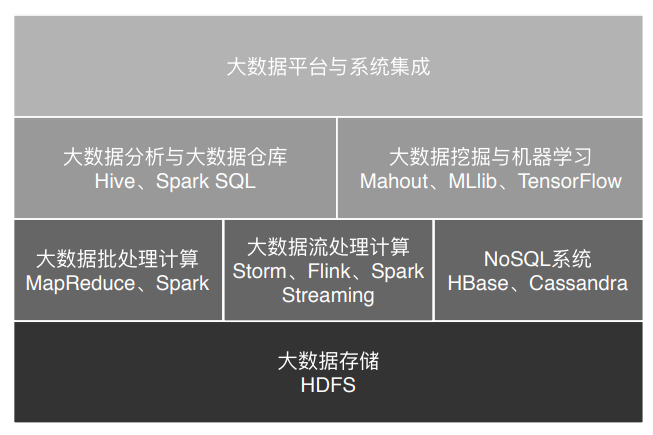
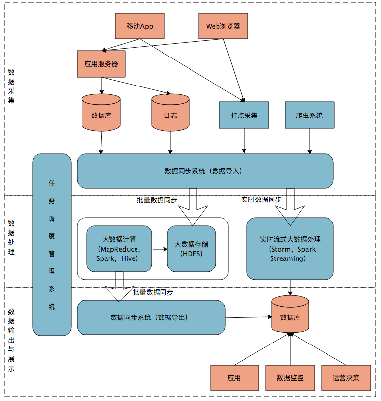

## 大数据学习总结

### 大数据应用领域
- 医疗健康领域:医学影像智能识别、病历大数据智能诊疗
- 教育领域：AI 外语老师、智能解题
- 社交媒体领域：舆情监控与分析、智能广告投放
- 金融领域：大数据风控
- 新零售领域：全链路管理
- 交通领域：导航软件、无人驾驶技术

### hadoop技术体系

### 大数据应用发展史
- 搜索引擎时代
- 数据仓库时代
- 数据挖掘时代
- 机器学习时代

### 大数据采用的架构模式：一主多从
可重复使用的架构方案叫作架构模式，一主多从可谓是大数据领域的最主要的架构模式，也是绝大多数大数据系统的架构方案。。主服务器只有一台，掌控全局；从服务器很多台，负责具体的事情。这样很多台服务器可以有效组织起来，对外表现出一个统一又强大的计算能力。
- HDFS:NameNode + DataNode
- Yarn: ResourceManager + NodeManager
- MapReduce: JobTracker + TaskTracker
- Spark : Master + Slave
- Storm: Nimbus + Supervisor
- Hbase: HMaster + HRegionServer
- Flink：JobManager + TaskManager

大数据因为要对数据和计算任务进行统一管理，所以和互联网在线应用不同，需要一个全局管理者。而在线应用因为每个用户请求都是独立的，而且为了高性能和便于集群伸缩，会尽量避免有全局管理者。所以我们从 Hadoop 中可以学到大数据领域的一个架构模式，也就是集中管理，分布存储与计算。

### Hadoop大数据原理与架构

Hadoop 主要是由三部分组成，除了前面我讲过的分布式文件系统 HDFS、分布式计算框架 MapReduce，还有一个是分布式集群资源调度框架 Yarn。

1. 分布式文件系统 HDFS

RAID 技术只是在单台服务器的多块磁盘上组成阵列，大数据需要更大规模的存储空间和更快的访问速度。将 RAID 思想原理应用到分布式服务器集群上，就形成了 Hadoop 分布式文件系统 HDFS 的架构思想。

NameNode 负责整个分布式文件系统的元数据（MetaData）管理，也就是文件路径名、数据块的 ID 以及存储位置等信息，相当于操作系统中文件分配表（FAT）的角色。
DataNode 负责文件数据的存储和读写操作，HDFS 将文件数据分割成若干数据块（Block），每个 DataNode 存储一部分数据块，这样文件就分布存储在整个 HDFS 服务器集群中。应用程序客户端（Client）可以并行对这些数据块进行访问，从而使得 HDFS 可以在服务器集群规模上实现数据并行访问，极大地提高了访问速度。

2. 分布式计算框架 MapReduce
大数据计算基本原则:移动计算比移动数据更划算
MapReduce 是一种非常简单又非常强大的编程模型？简单在于其编程模型只包含 Map 和 Reduce 两个过程，map 的主要输入是一对 <key,value> 值，经过 map 计算后输出一对<key,value>值；然后将相同 Key 合并，形成<key,Set<value>> ；再将这个<key,Set<value>>输入 reduce，经过计算输出零个或多个<key,value>对。

在 map 输出与 reduce 输入之间，MapReduce 计算框架处理数据合并与连接操作，这个操作有个专门的词汇叫 shuffle。那到底什么是 shuffle？shuffle 的具体过程又是怎样的呢？请看下图。

分布式计算需要将不同服务器上的相关数据合并到一起进行下一步计算，这就是 shuffle。shuffle 是大数据计算过程中最神奇的地方，不管是 MapReduce 还是 Spark，只要是大数据批处理计算，一定都会有 shuffle 过程，只有让数据关联起来，数据的内在关系和价值才会呈现出来。如果你不理解 shuffle，肯定会在 map 和 reduce 编程中产生困惑，不知道该如何正确设计 map 的输出和 reduce 的输入。shuffle 也是整个 MapReduce 过程中最难、最消耗性能的地方，在 MapReduce 早期代码中，一半代码都是关于 shuffle 处理的。

3. 分布式集群资源调度框架 Yarn
为什么要有Yarn：在 MapReduce 应用程序的启动过程中，最重要的就是要把 MapReduce 程序分发到大数据集群的服务器上，在 Hadoop 1 中，这个过程主要是通过 JobTracker 和 TaskTracker 通信来完成。这个方案有什么缺点吗？服务器集群资源调度管理和 MapReduce 执行过程耦合在一起，如果想在当前集群中运行其他计算任务，比如 Spark 或者 Storm，就无法统一使用集群中的资源了。

### spark
MapReduce计算模型分为Map 阶段和Reduce 阶段，我们用MapReduce编程的时候，思考的是如何把计算逻辑用Map和Reduce两个阶段来实现，map和reduce函数的输入和输出是什么，这是一个面向过程的面向过程的大数据计算。
而Spark针对数据进行编程，把数据集合抽象成RDD对象[弹性分布式数据集 (Resilient Distributed DataSet)]，然后在RDD上进行各种计算，得到一个新的RDD，知道最后的结果。我们用Spark编程思考的是一个RDD对象要经过怎么样的操作，转换成另一个RDD，这是一个面向过程的面向对象的大数据计算，思考的重心和落脚点都在 RDD 上。

Spark 实现分布式计算的最小单位是计算任务（Task），每个任务针对一个不同数据分片进行计算，相同的一组任务组成一个任务集（TaskSet），通常一个任务集就是一个计算阶段（Stage），所有的计算阶段组成一个有向无环图（DAG）.

Spark 作业调度执行的核心是 DAG，有了 DAG，整个应用就被切分成哪些阶段，每个阶段的依赖关系也就清楚了。之后再根据每个阶段要处理的数据量生成相应的任务集合（TaskSet），每个任务都分配一个任务进程去处理，Spark 就实现了大数据的分布式计算。
计算阶段划分的依据是 shuffle，不是转换函数的类型。不需要进行 shuffle 的依赖，在 Spark 里被称作窄依赖；相反的，需要进行 shuffle 的依赖，被称作宽依赖。跟 MapReduce 一样，shuffle 也是 Spark 最重要的一个环节，只有通过 shuffle，相关数据才能互相计算，构建起复杂的应用逻辑。

spark比MapReduce性能高的原因：
- DAG 切分的多阶段计算过程更快速: Spark 更细腻一点，将前一个的 Reduce 和后一个的 Map 连接起来，当作一个阶段持续计算，形成一个更加优雅、高效地计算模型，虽然其本质依然是 Map 和 Reduce。但是这种多个计算阶段依赖执行的方案可以有效减少对 HDFS 的访问，减少作业的调度执行次数，因此执行速度也更快。
- 使用内存存储中间计算结果更高效: 和 Hadoop MapReduce 主要使用磁盘存储 shuffle 过程中的数据不同，Spark 优先使用内存进行数据存储，包括 RDD 数据。除非是内存不够用了，否则是尽可能使用内存。

Spark 的 DAGScheduler 在遇到 shuffle 的时候，会生成一个计算阶段stage，在遇到 action 函数的时候，会生成一个作业（job）。

### hbase:
hbase架构图：

hbase调用时序图：

HBase 的做法是按 Key 的区域进行分片，这个分片也就是 HRegion。应用程序通过 HMaster 查找分片，得到 HRegion 所在的服务器 HRegionServer，然后和该服务器通信，就得到了需要访问的数据。**这个逻辑和es按index分片，kafka按topic分区是类似的。但和Memcached,redis这类分布式缓存的路由算法不同**。

为了提高数据写入速度，HBase 使用了一种叫作 LSM 树的数据结构进行数据存储。LSM 树的全名是 Log Structed Merge Tree，翻译过来就是 Log 结构合并树。数据写入的时候以 Log 方式连续写入，然后异步对磁盘上的多个 LSM 树进行合并。

在需要进行读操作时，总是从内存中的排序树开始搜索，如果没有找到，就从磁盘 上的排序树顺序查找。
在 LSM 树上进行一次数据更新不需要磁盘访问，在内存即可完成。当数据访问以写操作为主，而读操作则集中在最近写入的数据上时，使用 LSM 树可以极大程度地减少磁盘的访问次数，加快访问速度。

### 大数据流计算框架
- Storm:把多个消息队列+多个处理逻辑形成的流程，抽象为spout+bolt。
- Spark Stream:利用了 Spark 的分片和快速计算的特性，将实时传输进来的数据按照时间进行分段
- Flink：Flink 则相反，一开始就是按照流处理计算去设计的。当把从文件系统（HDFS）中读入的数据也当做数据流看待，他就变成批处理系统了。
Flink 处理实时数据流的方式跟 Spark Streaming 也很相似，也是将流数据分段后，一小批一小批地处理。流处理算是 Flink 里的“一等公民”，Flink 对流处理的支持也更加完善，它可以对数据流执行 window 操作，将数据流切分到一个一个的 window 里，进而进行计算。

### ZooKeeper
ZooKeeper 主要提供数据的一致性服务，其实现分布式系统的状态一致性依赖一个叫 Paxos 的算法。

### 各类技术如何在hadoop集群物理机器上运行的
所以上面所有这些技术在实际部署的时候，通常会部署在同一个集群中，也就是说，在由很多台服务器组成的服务器集群中，某台服务器可能运行着 HDFS 的 DataNode 进程，负责 HDFS 的数据存储；同时也运行着 Yarn 的 NodeManager，负责计算资源的调度管理；而 MapReduce、Spark、Storm、Flink 这些批处理或者流处理大数据计算引擎则通过 Yarn 的调度，运行在 NodeManager 的容器（container）里面。至于 Hive、Spark SQL 这些运行在 MapReduce 或者 Spark 基础上的大数据仓库引擎，在经过自身的执行引擎将 SQL 语句解析成 MapReduce 或者 Spark 的执行计划以后，一样提交给 Yarn 去调度执行。
这里相对比较特殊的是 HBase，作为一个 NoSQL 存储系统，HBase 的应用场景是满足在线业务数据存储访问需求，通常是 OLTP（在线事务处理）系统的一部分，为了保证在线业务的高可用和资源独占性，一般是独立部署自己的集群，和前面的 Hadoop 大数据集群分离部署。

### 最好的学习新技术的方式
**通过原始论文掌握核心设计原理以后，如果需要进一步学习，就去官网看官方文档；如果还需要再进一步参与开发，就去读源代码。
刚开始读论文时感觉很费劲，但是后面习惯以后，发现读论文真的是最快的学习方法，因为最核心的东西就在其中，一旦看懂，就真的懂了，而且可以触类旁通，整个软件从使用到开发，很多细节通过脑补就可以猜个八九不离十。而且越是优秀的产品，越是厉害的作者，论文反而越是容易读懂，可能是因为这些作者是真的高手，自己理得越清楚，写出来的论文越是脉络清晰、结构合理、逻辑严谨。
**

### 大数据平台
大数据平台，顾名思义就是整合网站应用和大数据系统之间的差异，将应用程序产生的数据导入到大数据系统，经过处理计算后再导出给应用程序使用。
大数据平台由上到下，可分为三个部分：数据采集、数据处理、数据输出与展示。典型的大数据平台架构如下：

大数据从哪里来:
- 从数据库导入:Sqoop 适合关系数据库数据的批量导入，Canal适合实时导入关系数据库的数据。
- 从日志文件导入：Flume 是大数据日志收集常用的工具。Flume 最早由 Cloudera 开发。
- 端埋点采集：手工埋点和自动化埋点。
- 爬虫系统：

### 大数据解决方案提供商
Cloudera的产品CDH 是一个大数据集成平台，将主流大数据产品都集成到这个平台中，企业可以使用 CDH 一站式部署整个大数据技术栈。从架构分层角度，CDH 可以分为 4 层：系统集成，大数据存储，统一服务，过程、分析与计算。

国内本土和 Cloudera 对标的公司是星环科技。核心产品是类似 CDH 的 TDH

大数据云计算服务商：阿里云等
大数据 SaaS 服务商：友盟、神策、百度统计等
大数据开放平台：

### 大数据算法
所谓人工智能就是利用数学统计方法，统计数据中的规律，然后利用这些统计规律进行自动化数据处理，使计算机表现出某种智能的特性，而各种数学统计方法，就是大数据算法。
现在火热的机器学习本质上说就是统计学习。

1. 监督算法：
	- KNN:K 近邻（K Nearest Neighbour）算法。空间之间的距离计算方法有很多种，常用的有欧氏距离、余弦距离等。
	- 贝叶斯分类
2. 无监督算法:
	- PageRank 算法通过挖掘链接关系，发现互联网网页的排名权重；
	- Apriori 算法通过购物篮分析，发现商品的频繁模式；
	- K-means 算法则可以进行自动数据聚类。

推荐引擎:
- 基于用户统计的推荐、
- 基于商品属性的推荐、
- 基于用户的协同过滤推荐、
- 基于商品的协同过滤推荐。

基于用户的协同过滤推荐和基于人口统计的推荐都是将用户分类后，根据同类用户的喜好为当前用户进行推荐。不同的是，基于人口统计的推荐仅仅根据用户的个人信息进行分类，分类的粒度比较大，准确性也较差；而基于用户的协同过滤推荐则根据用户历史喜好进行分类，能够更准确地反映用户的喜好类别，推荐效果也更好一点。