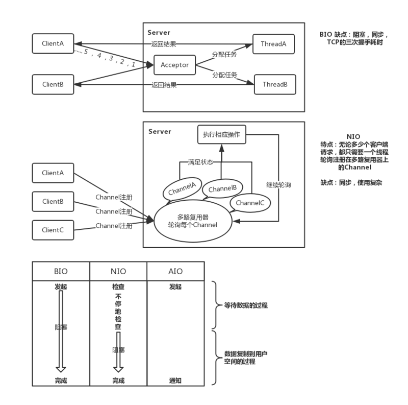

I/O多路复用(Reactor模式):Reactor是事件反应的意思，来了一个事件我就有相应的反应。Reactor 模式也叫 Dispatcher 模式，更加贴近模式本身的含义，即 I/O 多路复用统一监听事件，收到事件后分配（Dispatch）给某个进程。
Reactor 模式的核心组成部分包括 Reactor 和处理资源池（进程池或线程池），其中 Reactor 负责监听和分配事件，处理资源池负责处理事件。
需要处理的事件有：accept，read/write/close，业务处理，根据这些事件在哪里处理的，最终 Reactor 模式有这三种典型的实现方案：
	- 单 Reactor 单线程/进程 。
	只用一个线程同时处理accept，read/write/close，业务处理等事情。比如redis。
	- 单 Reactor 多线程/进程。
	把IO事件accept，read/write/close由reactor处理，业务处理由子线程处理。
		
	- 多 Reactor 多线程/进程。
	把IO中的accept由主reactor处理，而其他的io事件，如read/write/close分配给子reactor处理。比如nginx和netty，nginx是master和worker，netty是boss和worker。

以上方案具体选择进程还是线程，更多地是和编程语言及平台相关。例如，Java 语言一般使用线程（例如Netty），C 语言使用进程和线程都可以。例如，Nginx 使用进程，Memcache 使用线程。

reactor和proactor的区别：reactor是io事件来了（os把数据写到内核缓冲区了），io就会通知你；而proactor是io事件来了，os会把数据从内核缓冲区写到用户空间，再通知你。

select、poll、epoll区别：
- select：select本质上是通过设置或者检查存放fd标志位的数据结构来进行下一步处理。它仅仅知道了，有I/O事件发生了，却并不知道是哪那几个流，我们只能无差别轮询所有流。
- poll：poll本质上和select没有区别，它将用户传入的数组拷贝到内核空间，然后查询每个fd对应的设备状态， 但是它没有最大连接数的限制，原因是它是基于链表来存储的.
- epoll：epoll可以理解为event poll，不同于忙轮询和无差别轮询，epoll会把哪个流发生了怎样的I/O事件通知我们。所以我们说epoll实际上是事件驱动（每个事件关联上fd）的，此时我们对这些流的操作都是有意义的。

select，poll，epoll本质上都是同步I/O，因为他们都需要在读写事件就绪后自己负责进行读写，也就是说这个读写过程是阻塞的，而异步I/O则无需自己负责进行读写，异步I/O的实现会负责把数据从内核拷贝到用户空间。  
