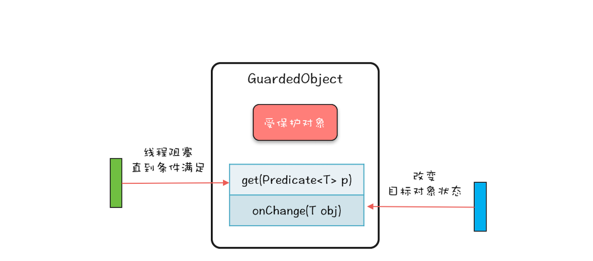

##  Java并发编程实战

### 并发编程的全景图
并发编程可以总结为三个核心问题：
- 分工：如何高效地拆解任务并分配给线程
- 同步（协作）：线程之间如何协作，即一个线程执行完了一个任务，如何通知执行后续任务的线程开工。
	Java SDK 并发包里的 Executor、Fork/Join、Future 本质上都是分工方法，但同时也能解决线程协作的问题。Java SDK 里提供的 CountDownLatch、CyclicBarrier、Phaser、Exchanger、Semaphore也都是用来解决线程协作问题的。
	工作中遇到的线程协作问题，基本上都可以描述为这样的一个问题：**当某个条件不满足时，线程需要等待，当某个条件满足时，线程需要被唤醒执行**。
- 互斥：保证同一时刻只允许一个线程访问共享资源。分工、同步主要强调的是性能，但并发程序里还有一部分是关于正确性的，用专业术语叫“线程安全”。
互斥除了锁，还可以使用其他无锁技术：CAS、copy-on-write、ThreadLocal、final等。

Java SDK 并发包很大部分内容都是按照这三个维度组织的，例如 Fork/Join 框架就是一种分工模式，CountDownLatch 就是一种典型的同步协作方式，而可重入锁则是一种互斥手段。
在 Java 并发编程领域，解决协作问题的核心技术是管程，也就是java中的monitor.上面提到的所有线程协作技术底层都是利用管程解决的。管程是一种解决并发问题的通用模型，除了能解决线程协作问题，还能解决下面我们将要介绍的互斥问题。可以这么说，管程是解决并发问题的万能钥匙。

### 并发编程Bug的源头:
为什么要并发编程？CPU、内存、I/O，这三者存在巨大的速度差异。为了平衡这三者的速度差异，计算机体系结构、操作系统、编译程序都做出了贡献，主要体现为：
- CPU 增加了缓存，以均衡与内存的速度差异；
- 操作系统增加了进程、线程，以分时复用 CPU，进而均衡 CPU 与 I/O 设备的速度差异；
- 编译程序优化指令执行次序，使得缓存能够得到更加合理地利用。

于是出现了以下问题：
- 可见性：缓存导致的可见性问题
- 原子性：线程切换带来的原子性问题
- 有序性：编译优化带来的有序性问题

### Java如何解决可见性和有序性问题？
合理的方案应该是按需禁用缓存以及编译优化。Java 内存模型本质上可以理解为，Java 内存模型JMM规范了 JVM 如何提供按需禁用缓存和编译优化的方法。具体来说，这些方法包括 volatile、synchronized 和 final 三个关键字，以及六项 Happens-Before 规则。

Happens-Before 并不是说前面一个操作发生在后续操作的前面，它真正要表达的是：前面一个操作的结果对后续操作是可见的。
- 程序的顺序性规则
- volatile 变量规则：对一个 volatile 变量的写操作， Happens-Before 于后续对这个 volatile 变量的读操作。边界就是只要给volatile赋值成功，那么这个赋值语句之前所有代码的执行结果都对其他线程可见。
- 管程锁定规则：一个unlock操作先行发生于后面对同一个锁的lock操作。
- 线程启动规则：Thread对象的start()方法先行发生于此线程的每一个动作。
- 线程终止规则：线程中的所有操作都先行发生于对此线程的终止检测，我们可以通过Thread.join（）方法结束、Thread.isAlive（）的返回值等手段检测到线程已经终止执行。
- 线程中断规则：对线程interrupt()方法的调用先行发生于被中断线程的代码检测到中断事件的发生，可以通过Thread.interrupted()方法检测到是否有中断发生。
- 对象终结规则：一个对象的初始化完成(构造函数执行结束)先行发生于它的finalize()方法的开始。

Java内存模型底层怎么实现的？主要是通过内存屏障(memory barrier)禁止重排序的，即时编译器根据具体的底层体系架构，将这些内存屏障替换成具体的 CPU 指令。对于编译器而言，内存屏障将限制它所能做的重排序优化。

### 原子性问题：使用互斥锁解决
必须深入分析锁定的对象和受保护资源的关系，综合考虑受保护资源的访问路径，多方面考量才能用好互斥锁。
加锁本质就是在锁对象的对象头中写入当前线程id，但是new Object每次在内存中都是新对象，所以加锁无效。总之，需要确认锁对象究竟是一个，还是不同的多个，比如是X.class还是this，还是想new Object这样的对象。多个对象锁相当于一个厕所有多个门，一个对象锁对应一个门。

受保护资源和锁之间合理的关联关系应该是 N:1 的关系，也就是说可以用一把锁来保护多个资源。
解决原子性问题，本质是要保证中间状态对外不可见。

### 等待-通知机制：
一个完整的等待 - 通知机制：线程首先获取互斥锁，当线程要求的条件不满足时，释放互斥锁，进入等待状态；当要求的条件满足时，通知等待的线程，重新获取互斥锁。


### 并发编程中需要注意的问题
主要有三个方面，分别是：
- 安全性问题:什么是线程安全呢？其实本质上就是正确性，而正确性的含义就是程序按照我们期望的执行，不要让我们感到意外。主要考虑三个问题：原子性问题、可见性问题和有序性问题。只有一种情况需要：存在共享数据并且该数据会发生变化，通俗地讲就是有多个线程会同时读写同一数据。
- 活跃性问题：指的是某个操作无法执行下去，包括死锁、活锁、饥饿
- 性能问题：
	- 既然使用锁会带来性能问题，那最好的方案自然就是使用无锁的算法和数据结构了。
	- 减少锁持有的时间。互斥锁本质上是将并行的程序串行化，所以要增加并行度，一定要减少持有锁的时间。


竞态条件（Race Condition）。所谓竞态条件，指的是程序的执行结果依赖线程执行的顺序。
也可以按照下面这样来理解竞态条件：在并发场景中，程序的执行依赖于某个状态变量，也就是类似于下面这样：
```
if (状态变量 满足 执行条件) { 
	执行操作
}
```

并发编程是一个复杂的技术领域，微观上涉及到原子性问题、可见性问题和有序性问题，宏观则表现为安全性、活跃性以及性能问题。
我们在设计并发程序的时候，主要是从宏观出发，也就是要重点关注它的安全性、活跃性以及性能。安全性方面要注意数据竞争和竞态条件，活跃性方面需要注意死锁、活锁、饥饿等问题，性能方面我们虽然介绍了两个方案，但是遇到具体问题，你还是要具体分析，根据特定的场景选择合适的数据结构和算法。


### 管程：并发编程的万能钥匙
Java 采用的是管程技术，synchronized 关键字及 wait()、notify()、notifyAll() 这三个方法都是管程的组成部分。而管程和信号量是等价的，所谓等价指的是用管程能够实现信号量，也能用信号量实现管程。但是管程更容易使用，所以 Java 选择了管程。

管程，对应的英文是 Monitor，很多 Java 领域的同学都喜欢将其翻译成“监视器”，这是直译。操作系统领域一般都翻译成“管程”，这个是意译，而我自己也更倾向于使用“管程”。

所谓管程，指的是管理共享变量以及对共享变量的操作过程，让他们支持并发。翻译为 Java 领域的语言，就是管理类的成员变量和成员方法，让这个类是线程安全的。

MESA 管程模型里面，T2 通知完 T1 后，T2 还是会接着执行，T1 并不立即执行，仅仅是从条件变量的等待队列进到入口等待队列里面。这样做的好处是 notify() 不用放到代码的最后，T2 也没有多余的阻塞唤醒操作。但是也有个副作用，就是当 T1 再次执行的时候，可能曾经满足的条件，现在已经不满足了，所以需要以循环方式检验条件变量。

Java 参考了 MESA 模型，语言内置的管程（synchronized）对 MESA 模型进行了精简。MESA 模型中，条件变量可以有多个，Java 语言内置的管程里只有一个条件变量。
Java 内置的管程方案（synchronized）使用简单，synchronized 关键字修饰的代码块，在编译期会自动生成相关加锁和解锁的代码，但是仅支持一个条件变量；而 Java SDK 并发包实现的管程支持多个条件变量，不过并发包里的锁，需要开发人员自己进行加锁和解锁操作。

mesa管程中wait()必须是在一个while(条件)的循环里面，因为wait()方法必须是别的线程判断到条件满足之后调用notify，把之前的线程唤醒到入口队列重新竞争锁，等拿到锁之后是从wait()之后开始执行的，而此时有可能那个条件又变得不满足了，所有需要重新判断条件是否满足，因此需要在while(条件)里面执行wait()。

### java线程的生命周期
Java 语言中线程共有六种状态，分别是：
- NEW（初始化状态）
- RUNNABLE（可运行 / 运行状态）
- BLOCKED（阻塞状态）
- WAITING（无时限等待）
- TIMED_WAITING（有时限等待）
- TERMINATED（终止状态）

interrupt()方法的作用：仅仅是通知线程，线程有机会执行一些后续操作，同时也可以无视这个通知。被 interrupt 的线程，是怎么收到通知的呢？一种是异常，另一种是用isInterrupted()主动检测。

### 创建多少线程合适?
在并发编程领域，提升性能本质上就是提升硬件的利用率，再具体点来说，就是提升 I/O 的利用率和 CPU 的利用率。关于这个综合利用率的问题，操作系统虽然没有办法完美解决，但是却给我们提供了方案，那就是：多线程。

I/O 密集型程序和 CPU 密集型程序，计算最佳线程数的方法是不同的。
- 对于 CPU 密集型的计算场景，理论上“线程的数量 =CPU 核数”就是最合适的。不过在工程上，线程的数量一般会设置为“CPU 核数 +1”
- 对于 I/O 密集型的计算场景，最佳线程数 =CPU 核数 * [ 1 +（I/O 耗时 / CPU 耗时）]
其实只要把握住一条原则就可以了，这条原则就是将硬件CPU的性能发挥到极致。

### 如何用面向对象思想写好并发程序?
在 Java 语言里，面向对象思想能够让并发编程变得更简单。
- 封装共享变量:好在有了面向对象思想，对共享变量的访问路径可以轻松把控。
- 识别共享变量间的约束条件
- 制定并发访问策略:
	- 避免共享：避免共享的技术主要是利于线程本地存储以及为每个任务分配独立的线程。
	- 不变模式：这个在 Java 领域应用的很少，但在其他领域却有着广泛的应用，例如 Actor 模式、CSP 模式以及函数式编程的基础都是不变模式。
	- 管程及其他同步工具：Java 领域万能的解决方案是管程，但是对于很多特定场景，使用 Java 并发包提供的读写锁、并发容器等同步工具会更好。

### 理论基础模块总结：

起源是一个硬件的核心矛盾：CPU 与内存、I/O 的速度差异，系统软件（操作系统、编译器）在解决这个核心矛盾的同时，引入了可见性、原子性和有序性问题，这三个问题就是很多并发程序的 Bug 之源。

那如何解决这三个问题呢？Java 语言自然有招儿，它提供了 Java 内存模型和互斥锁方案。所以，在02我们介绍了 Java 内存模型，以应对可见性和有序性问题；那另一个原子性问题该如何解决？多方考量用好互斥锁才是关键，这就是03和04的内容。

管程，是 Java 并发编程技术的基础，是解决并发问题的万能钥匙。并发编程里两大核心问题——互斥和同步，都是可以由管程来解决的。所以，学好管程，就相当于掌握了一把并发编程的万能钥匙。


并发编程总结：
**目标：安全性、活跃性、高性能
问题：可见性、原子性、有序性
手段：分工、同步、互斥
**

### java并发包中monitor（管程）的实现：
Java SDK 并发包通过 Lock 和 Condition 两个接口来实现管程，其中 Lock 用于解决互斥问题，Condition 用于解决同步问题。

Lock 有别于 synchronized 隐式锁的三个特性：能够响应中断、支持超时和非阻塞地获取锁。
Condition 实现了管程模型里面的条件变量。

同步和异步的区别到底是什么呢？通俗点来讲就是调用方是否需要等待结果，如果需要等待结果，就是同步；如果不需要等待结果，就是异步。同步，是 Java 代码默认的处理方式。如果你想让你的程序支持异步，可以通过下面两种方式来实现：
- 调用方创建一个子线程，在子线程中执行方法调用，这种调用我们称为异步调用；
- 方法实现的时候，创建一个新的线程执行主要逻辑，主线程直接 return，这种方法我们一般称为异步方法。

### 信号量模型
信号量是由大名鼎鼎的计算机科学家迪杰斯特拉（Dijkstra）于 1965 年提出，在这之后的 15 年，信号量一直都是并发编程领域的终结者，直到 1980 年管程(monitor)被提出来，我们才有了第二选择。目前几乎所有支持并发编程的语言都支持信号量机制，所以学好信号量还是很有必要的。
信号量模型还是很简单的，可以简单概括为：一个计数器，一个等待队列，三个方法。

Semaphore 还有一个功能是 Lock 不容易实现的，那就是：Semaphore 可以允许多个线程访问一个临界区。

理论上用**管程和信号量**这两个同步原语的任何一个都可以解决所有的并发问题。那 Java SDK 并发包里为什么还有很多其他的工具类呢？原因很简单：分场景优化性能，提升易用性。

### juc中各种用途的锁：
- ReentrantLock:可重入锁。
- ReadWriteLock:读写锁，支持两种模式：一种是读锁，一种是写锁。适用于读多写少的场景
- StampedLock:支持三种模式，分别是：写锁、悲观读锁和乐观读(乐观读这个操作是无锁的)。StampedLock 的乐观读和数据库的乐观锁有异曲同工之妙。StampedLock 的功能仅仅是 ReadWriteLock 的子集。在使用的时候需要注意：
	- StampedLock 不支持重入，
	- StampedLock 的悲观读锁、写锁都不支持条件变量。
	- 使用 StampedLock 一定不要调用中断操作，否则CPU飙升到100%。

### juc中各种线程协作工具类：
- CountDownLatch：主要用来解决一个线程等待多个线程完成的场景。
- CyclicBarrier：主要用于一组线程之间互相等待的场景。
- Phaser：一个可重用的同步barrier
- Exchanger：用于两个线程交换数据
- Semaphore：信号量，用于控制允许n个线程同时执行。

### juc中的并发容器：
Java 中的容器主要可以分为四个大类，分别是 List、Map、Set 和 Queue。
- List:CopyOnWriteArrayList
- Map:ConcurrentHashMap(key无序) 和 ConcurrentSkipListMap(key有序)
- Set:CopyOnWriteArraySet 和 ConcurrentSkipListSet
- Queue:Java 并发包里面 Queue 这类并发容器是最复杂的，你可以从以下两个维度来分类。一个维度是阻塞与非阻塞，用Blocking标识阻塞队列。另一个维度是单端与双端，单端队列使用 Queue 标识，双端队列使用 Deque 标识。
	- 单端阻塞队列：其实现有 ArrayBlockingQueue、LinkedBlockingQueue、SynchronousQueue、LinkedTransferQueue、PriorityBlockingQueue 和 DelayQueue。
	- 双端阻塞队列：其实现是 LinkedBlockingDeque。
	- 单端非阻塞队列：其实现是 ConcurrentLinkedQueue。
	- 双端非阻塞队列：其实现是 ConcurrentLinkedDeque。


### juc中的原子类：

AtomicReference的作用：
当多线程下，你有这样的需求时：if(this.obj == oldObj) this.obj = newObj;的时候，可以使用AtomicReference.compareAndSet()方法实现线程安全。比如你有一个AtomicReference<Money>实现金钱的一些比较操作时。 

### juc中的线程池
创建一个线程，却需要调用操作系统内核的 API，然后操作系统要为线程分配一系列的资源，这个成本就很高了，所以线程是一个重量级的对象，应该避免频繁创建和销毁。应对方案就是线程池。
一般意义上的池化资源，都是下面这样，当你需要资源的时候就调用 acquire() 方法来申请资源，用完之后就调用 release() 释放资源。而翻遍 Thread 对象的所有方法，都不存在类似 execute(Runnable target) 这样的公共方法。线程池是一种生产者 - 消费者模式，理解生产者 - 消费者模式是理解线程池的关键所在。建好的线程都会启动起来，阻塞在queue.take()方法上。

Java 提供的线程池相关的工具类中，最核心的是 ThreadPoolExecutor，通过名字你也能看出来，它强调的是 Executor，而不是一般意义上的池化资源。可以把线程池类比为一个项目组，而线程就是项目组的成员。

### 各种线程协作工具类
Runnable无返回值，Callable有一个返回值，他们都代表一个任务。
Future 代表异步操作的结果。异步操作需要关注两个问题：一个是异步操作什么时候结束，另一个是如何获取异步操作的执行结果。Future都能够解决。
FutureTask 实现了 Runnable 和 Future 接口。代表任务以及结果。

CompletionStage：任务是有时序关系的，比如有串行关系、并行关系、汇聚关系等。CompletionStage 接口可以清晰地描述任务之间的这种时序关系
- 描述串行关系：thenApply、thenAccept、thenRun 和 thenCompose 这四个系列的接口。
- 描述 AND 汇聚关系：thenCombine、thenAcceptBoth 和 runAfterBoth
- 描述 OR 汇聚关系：applyToEither、acceptEither 和 runAfterEither
- 异常处理:exceptionally

CompletableFuture 实现了CompletionStage和Future。能够满足简单的异步编程需求。

CompletionService:将线程池 Executor 和阻塞队列 BlockingQueue 的功能融合在了一起，把任务的结果放入阻塞队列中。CompletionService 能够让异步任务的执行结果有序化，先执行完的先进入阻塞队列，利用这个特性，你可以轻松实现后续处理的有序性，避免无谓的等待。

### Fork/Join：单机版的MapReduce:
Fork/Join 是一个并行计算的框架，主要就是用来支持分治任务模型的，这个计算框架里的 Fork 对应的是分治任务模型里的任务分解，Join 对应的是结果合并。Fork/Join 计算框架主要包含两部分，一部分是分治任务的线程池 ForkJoinPool，另一部分是分治任务 ForkJoinTask。
这两部分的关系类似于 ThreadPoolExecutor 和 Runnable 的关系，都可以理解为提交任务到线程池，只不过分治任务有自己独特类型 ForkJoinTask。

ForkJoinTask的方法compute()一般是会分解为两个子任务t1,t2，其中一个子任务通过t1.fork()创建一个线程去执行，另一个子任务t1本线程直接执行，等任务都完成后，把t1和t2的结果merge之后返回。而实现【本线程执行一个任务t2，fork一个线程执行t1】的方式有两种：
- t2.fork(); t1.compute() + t1.join()
- t1.fork();t2.fork(); -> invokeAll(t1,t2); -> t1.join();t2.join(); 
https://www.liaoxuefeng.com/article/1146802219354112

### 线程池相关工具类总结：
线程池、Future、CompletableFuture 和 CompletionService这些工具类都是在帮助我们站在任务的视角来解决并发问题，而不是让我们纠缠在线程之间如何协作的细节上（比如线程之间如何实现等待、通知等）。
- 对于简单的并行任务，你可以通过“线程池 +Future”的方案来解决；
- 如果任务之间有聚合关系，无论是 AND 聚合还是 OR 聚合，都可以通过 CompletableFuture 来解决；
- 而批量的并行任务，则可以通过 CompletionService 来解决;
- 分治的任务模型，可以通过 Fork/Join 的并行计算框架来计算,即ForkJoinPool + ForkJoinTask。


### 函数式接口：
函数式接口FunctionInterface是指只有一个抽象方法的接口。
java.util.function 包下的函数式接口，分别是Consumer（消费型）、Supplier（供给型）、Predicate（谓词型）、Function（功能型）。
- Consumer（消费型）：消费数据的，方法accept有一个参数，没有返回值。
- Supplier（供给型）: 说白了就是一个容器，可以提供一个数据，方法get无参数，有返回值。
- Predicate（谓词型）:就是一个判断接口，方法test有一个参数，返回布尔类型。
- Function（功能型）：提供转换作用，将输入数据转换成另一种形式的输出数据。方法apply有一个参数，有返回值。


### 并发设计模式：
- 不变性（Immutability）模式。所谓不变性，简单来讲，就是对象一旦被创建之后，状态就不再发生变化。利用final关键字实现不可修改性。Java 语言里面的 String 和 Long、Integer、Double 等基础类型的包装类都具备不可变性。
享元模式（Flyweight Pattern）：本质上其实就是一个对象池。利用享元模式创建对象的逻辑也很简单：创建之前，首先去对象池里看看是不是存在；如果已经存在，就利用对象池里的对象；如果不存在，就会新创建一个对象，并且把这个新创建出来的对象放进对象池里。
基本上所有的基础类型的包装类都不适合做锁，因为它们内部用到了享元模式，这会导致看上去私有的锁，其实是共有的。

- Copy-On-Write模式：写时复制。例子：java的容器CopyOnWriteArrayList 和 CopyOnWriteArraySet；操作系统的进程fork时复制父进程地址空间。

- 线程本地存储模式：没有共享，就没有伤害。
	ThreadLocal的实现是：Thread持有一个ThradLocalMap，这个map以ThreadLocal为key。ThreadLocal 仅仅是一个代理工具类，内部并不持有任何与线程相关的数据，所有和线程相关的数据都存储在 Thread 里面，这样的设计容易理解。而从数据的亲缘性上来讲，ThreadLocalMap 属于 Thread 也更加合理。
	
	而我们一般能想到的方案是ThreadLocal里面有一个Map，这个map以Thread为key。这样的方案容易产生内存泄漏，因为ThreadLocal的生命周期一般很长，导致ThreadLocal持有的Thread也无法被回收。
	在线程池中使用 ThreadLocal 为什么可能导致内存泄露呢？原因就出在线程池中线程的存活时间太长，往往都是和程序同生共死的，这就意味着 Thread 持有的 ThreadLocalMap 一直都不会被回收，再加上 ThreadLocalMap 中的 Entry 对 ThreadLocal 是弱引用（WeakReference），所以只要 ThreadLocal 结束了自己的生命周期是可以被回收掉的。但是 Entry 中的 Value 却是被 Entry 强引用的，所以即便 Value 的生命周期结束了，Value 也是无法被回收的，从而导致内存泄露。

- Guarded Suspension模式(保护性地暂停)：等待唤醒机制的规范实现.
这个模式要解决的是，发送消息的线程和消费消息结果的线程不是同一个，但是消息结果又需要由发送的线程进行处理。像dubbo这样的框架，底层是netty，发送消息和接收消息结果是异步的，是由不同的线程处理的。需要接收消息结果的线程通知到发送消息的线程，这就是一个多线程下等待唤醒机制的规范实现。Dubbo中DefaultFuture 这个类也是采用的这种模式。

	
- Balking模式：再谈线程安全的单例模式
如果在多线程情况下，有对一个共享变量进行判断if(cond){}的操作，条件不满足不等待立刻返回，条件满足则执行一些操作，这就是balking模式。和Guarded Suspension模式不同点在于后者如果条件不满足需要等待，等到条件满足为止。

Balking 模式和Guarded Suspension模式本质上是一种规范化地解决“多线程版本的 if”的方案。从应用的角度来看，它们解决的都是“线程安全的if”语义，不同之处在于，Guarded Suspension 模式会等待 if 条件为真，而 Balking 模式不会等待。Balking 模式只需要用互斥锁就能解决，而 Guarded Suspension 模式则要用到管程这种高级的并发原语（wait,notify等）。

- Thread-Per-Message模式：最简单实用的分工方法
我们曾经把并发编程领域的问题总结为三个核心问题：分工、同步和互斥。其中，同步和互斥相关问题更多地源自微观，而分工问题则是源自宏观。解决并发编程问题，首要问题也是解决宏观的分工问题。并发编程领域里，解决分工问题也有一系列的设计模式，比较常用的主要有 **Thread-Per-Message 模式、Worker Thread 模式、生产者 - 消费者模式**等等。

Thread-Per-Message 模式就是为每个任务分配一个独立的线程。这是一种最简单的分工方法，实现起来也非常简单。如果使用支持轻量级线程的框架如Fiber，可以不使用线程池，请求来了新建一个轻量级线程，请求结束了直接弃用即可。

- Worker Thread模式
实现Worker Thread 模式的方式：用阻塞队列做任务池，然后创建固定数量的线程消费阻塞队列中的任务。其实你仔细想会发现，这个方案就是 Java 语言提供的线程池。

- 生产者-消费者模式：用流水线思想提高效率
Java 语言提供的线程池本身就是一种生产者 - 消费者模式的实现，但是线程池中的线程每次只能从任务队列中消费一个任务来执行，对于大部分并发场景这种策略都没有问题。但是有些场景还是需要自己来实现，例如需要批量执行以及分阶段提交的场景。

- 两阶段终止模式
将终止过程分成两个阶段：第一个阶段主要是线程 T1 向线程 T2发送终止指令，而第二阶段则是线程 T2响应终止指令。

Java 线程进入终止状态的前提是线程进入 RUNNABLE 状态，而实际上线程也可能处在休眠状态，也就是说，我们要想终止一个线程，首先要把线程的状态从休眠状态转换到 RUNNABLE 状态。如何做到呢？这个要靠 Java Thread 类提供的 interrupt() 方法，它可以将休眠状态的线程转换到 RUNNABLE 状态。
如何将线程从 RUNNABLE状态转换到终止状态：一般我们采用的方法是设置一个标志位，然后线程会在合适的时机检查这个标志位，如果发现符合终止条件，则自动退出 run() 方法。
总结起来就是interrupt() 方法和线程终止的标志位。

线程池提供了两个方法：shutdown()和shutdownNow():
	- shutdown() 方法是一种很保守的关闭线程池的方法。线程池执行 shutdown() 后，就会拒绝接收新的任务，但是会等待线程池中正在执行的任务和已经进入阻塞队列的任务都执行完之后才最终关闭线程池。
	- shutdownNow() 方法，相对就激进一些了，线程池执行 shutdownNow() 后，会拒绝接收新的任务，同时还会中断线程池中正在执行的任务，已经进入阻塞队列的任务也被剥夺了执行的机会，不过这些被剥夺执行机会的任务会作为 shutdownNow() 方法的返回值返回。
	- shutdown() 和 shutdownNow() 实质上使用的也是两阶段终止模式，只是终止指令的范围不同而已，前者只影响阻塞队列接收任务，后者范围扩大到线程池中所有的任务。

### 多线程设计模式总结：
- 避免共享的设计模式：Immutability 模式、Copy-on-Write 模式和线程本地存储模式本质上都是为了避免共享，只是实现手段不同而已
- 多线程版本 IF 的设计模式：Guarded Suspension 模式和 Balking 模式都可以简单地理解为“多线程版本的 if”，但它们的区别在于前者会等待 if 条件变为真，而后者则不需要等待。
- 三种最简单的分工模式：Thread-Per-Message 模式、Worker Thread 模式和生产者 - 消费者模式是三种最简单实用的多线程分工方法。
- 一种优雅地终止线程方案：而两阶段终止模式是一种通用的终止线程的解决方案。其实终止生产者 - 消费者服务还有一种更简单的方案，叫做“毒丸”对象。


### 案例分析：
- 高性能限流器Guava RateLimiter:Guava 采用的是令牌桶算法，其核心是要想通过限流器，必须拿到令牌。经典的限流算法有两个，一个是令牌桶算法（Token Bucket），另一个是漏桶算法（Leaky Bucket）
- Netty：bossGroup 就用来处理连接请求的，而 workerGroup 是用来处理读写请求的。bossGroup 处理完连接请求后，会将这个连接提交给 workerGroup 来处理， workerGroup 里面有多个 EventLoop，那新的连接会交给哪个 EventLoop 来处理呢？这就需要一个负载均衡算法，Netty 中目前使用的是轮询算法。
为了实现高性能的目标，Netty 做了很多优化，例如优化了 ByteBuffer、支持零拷贝等等，和并发编程相关的就是它的线程模型了。Netty 的线程模型设计得很精巧，每个网络连接都关联到了一个线程上，这样做的好处是：对于一个网络连接，读写操作都是单线程执行的，从而避免了并发程序的各种问题。
- 高性能队列Disruptor:Disruptor 是一款高性能的有界内存队列，目前应用非常广泛，Log4j2、Spring Messaging、HBase、Storm 都用到了 Disruptor。Disruptor 性能高的原因：
	- 内存分配更加合理，使用 RingBuffer 数据结构，数组元素在初始化时一次性全部创建，提升缓存命中率；对象循环利用，避免频繁 GC。
	- 能够避免伪共享，提升缓存利用率。
	- 采用无锁算法，避免频繁加锁、解锁的性能消耗。
	- 支持批量消费，消费者可以无锁方式消费多个消息。
- 高性能数据库连接池HiKariCP:
FastList:FastList 相对于 ArrayList 的一个优化点就是将 remove(Object element) 方法的查找顺序变成了逆序查找。
ConcurrentBag:通过 ThreadLocal 做一次预分配，避免直接竞争共享资源，非常适合池化资源的分配

### Actor 模型
Actor 模型本质上是一种计算模型，基本的计算单元称为 Actor，换言之，在 Actor 模型中，所有的计算都是在 Actor 中执行的。在面向对象编程里面，一切都是对象；在 Actor 模型里，一切都是 Actor，并且 Actor 之间是完全隔离的，不会共享任何变量。所以很多人就把 Actor 模型定义为一种并发计算模型。
Actor 模型和面向对象编程契合度非常高，完全可以用 Actor 类比面向对象编程里面的对象，而且 Actor 之间的通信方式完美地遵守了消息机制，而不是通过对象方法来实现对象之间的通信。
Actor 中的消息机制，就可以类比这现实世界里的写信。Actor 内部有一个邮箱（Mailbox），接收到的消息都是先放到邮箱里，如果邮箱里有积压的消息，那么新收到的消息就不会马上得到处理，也正是因为 Actor 使用单线程处理消息，所以不会出现并发问题。你可以把 Actor 内部的工作模式想象成只有一个消费者线程的生产者 - 消费者模式。
actor模型发送消息和调用对象的区别：
- Actor 中的消息机制完全是异步的。而调用对象方法，实际上是同步的，对象方法 return 之前，调用方会一直等待。
- 除此之外，调用对象方法，需要持有对象的引用，所有的对象必须在同一个进程中。而在 Actor 中发送消息，类似于现实中的写信，只需要知道对方的地址就可以，发送消息和接收消息的 Actor 可以不在一个进程中，也可以不在同一台机器上。因此，Actor 模型不但适用于并发计算，还适用于分布式计算。
actor模型与reactor模型有什么关联和区别吗？雷锋和雷峰塔的关系。
- 软件事务内存（Software Transactional Memory，简称 STM）:模拟数据库MVCC的实现。TODO:实现有点复杂，以后仔细研究.
- 协程（Coroutine):我们可以把协程简单地理解为一种轻量级的线程.从操作系统的角度来看，线程是在内核态中调度的，而协程是在用户态调度的，协程切换的成本更低。
- CSP模型：可以简单地把 Golang 实现的 CSP 模型类比为生产者 - 消费者模式，而 channel 可以类比为生产者 - 消费者模式中的阻塞队列。


计算机里很多面向开发人员的技术，大多数都是在解决一个问题：易用性。协程作为一项并发编程技术，本质上也不过是解决并发工具的易用性问题而已。对于易用性，我觉得最重要的就是要适应我们的思维模式，在工作的前几年，我并没有怎么关注它，但是最近几年思维模式已成为我重点关注的对象。因为思维模式对工作的很多方面都会产生影响，例如质量。
一个软件产品是否能够活下去，从质量的角度看，最核心的就是代码写得好。那什么样的代码是好代码呢？我觉得，最根本的是可读性好。可读性好的代码，意味着大家都可以上手，而且上手后不会大动干戈。那如何让代码的可读性好呢？很简单，换位思考，用大众、普通的思维模式去写代码，而不是炫耀自己的各种设计能力。我觉得好的代码，就像人民的艺术一样，应该是为人民群众服务的，只有根植于广大群众之中，才有生命力。