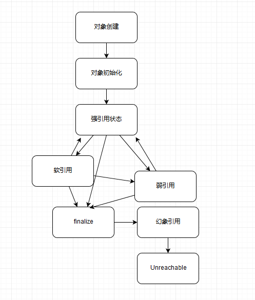
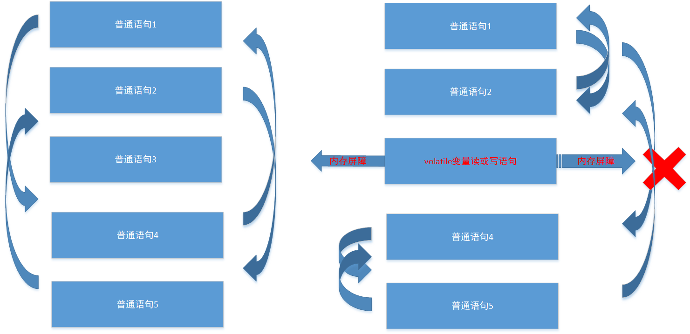
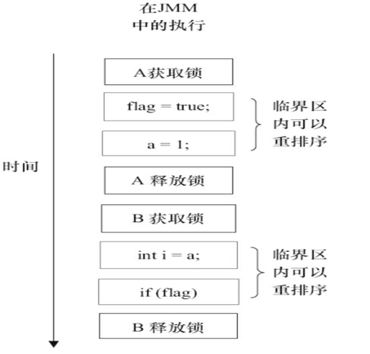
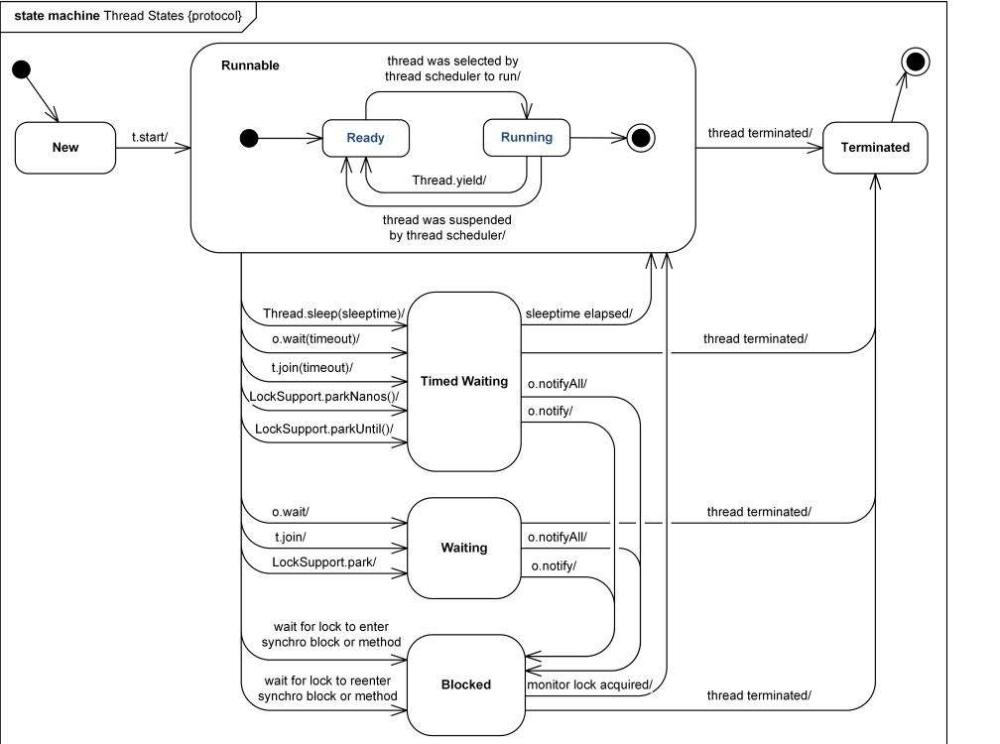
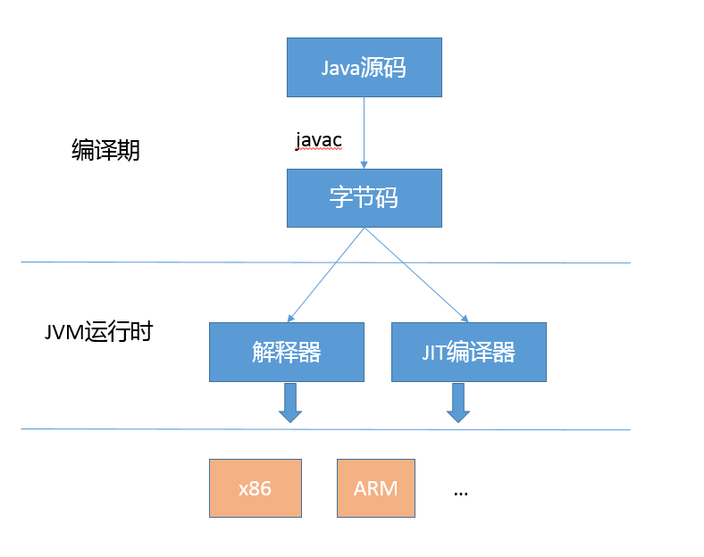

## java总结

1. NoClassDefFoundError和ClassNotFoundException的区别：
一个是error，一个是异常
NoClassDefFoundError产生的原因是class在编译时存在，但运行时不存在。可能是打包过程漏掉了部分类，或者jar包出现损坏或者篡改。
ClassNotFoundException产生的原因是：Java支持使用反射方式在运行时动态加载类，例如使用Class.forName方法来动态地加载类时，可以将类名作为参数传递给上述方法从而将指定类加载到JVM内存中，如果这个类在类路径中没有被找到，那么此时就会在运行时抛出ClassNotFoundException异常。

2. 强引用、软引用、弱引用、幻象引用有什么区别？
不同的引用类型，主要体现的是对象的生命周期和对垃圾收集的影响。
软引用（SoftReference），是一种相对强引用弱化一些的引用，可以让对象豁免一些垃圾收集，只有当 JVM 认为内存不足时，才会去试图回收软引用指向的对象。JVM 会确保在抛出 OutOfMemoryError 之前，清理软引用指向的对象。软引用通常用来实现内存敏感的缓存。
弱引用也是用来描述非必需对象的，当JVM进行垃圾回收时，无论内存是否充足，都会回收被弱引用关联的对象。
软引用关联的对象只有在内存不足时才会被回收，而被弱引用关联的对象在JVM进行垃圾回收时总会被回收。

虚引用和前面的软引用、弱引用不同，它并不影响对象的生命周期。如果一个对象与虚引用关联，则跟没有引用与之关联一样，在任何时候都可能被垃圾回收器回收。虚引用主要用来跟踪对象被垃圾回收的活动。

|级别 | 什么时候被垃圾回收 | 用途 | 生存时间
|:-:|:-:|:-:|:-:|
|强引用 |从来不会|对象的一般状态|JVM停止运行时终止
|软引用|在内存不足时|对象缓存|内存不足时终止
|弱引用|在垃圾回收时|对象缓存|gc运行后终止
|虚引用|gc执行之后|跟踪对象被垃圾回收的活动|被gc判断判定要回收之后

3. jdk的动态代理和cglib实现的优缺点。
动态代理应用非常广泛，虽然最初多是因为 RPC 等使用进入我们视线，但是动态代理的使用场景远远不仅如此，它完美符合 Spring AOP 等切面编程。

jdk的动态代理是以接口为中心的，被代理类必须实现特定的接口。jdk支持，减少依赖，实现简单。一般认为性能较差。
cglib 动态代理采取的是创建目标类的子类的方式。没有接口限制，高性能。

4. ConcurrentHashMap如何实现线程安全的？
1.7 ConcurrentHashMap，使用分段锁实现：默认用一个长度为16的segment数组，每一个segment管理一个table。可以把1.7的ConcurrentHashMap想象成是16个线程安全的hashtable拼凑成的hashMap。
1.8使用CAS来尽量避免加锁：在初始化时用cas保证只有一个线程做初始化工作，在put的时候扩容的话，多线程会一起帮助transfer，这里会用锁来保证数组的同一个位置只能由一个线程操作。cas和synchronized来保证并发安全，synchronized只锁住当前链表或者红黑二叉树的首节点，只要hash不冲突，就不会产生并发，效率很高。
size方法最终执行的是sumCount方法，在sumCount方法中，其实就是将baseCount的数值与CounterCell表中并发情况下插入的节点数量进行汇总累加得到。这个结果也把并发的情况也考虑进去了。

4. 为什么HashMap是线程不安全的？
HashMap的线程不安全体现在会造成死循环、数据丢失、数据覆盖这些问题。其中死循环和数据丢失是在JDK1.7中出现的问题，在JDK1.8中已经得到解决，然而1.8中仍会有数据覆盖这样的问题。
数据覆盖：两个线程同时put一个对象，key算到了同一个位置，两个线程都认为位置时空的，先put的就会被后面put的覆盖。还是代码里有++size的操作，这个也是权限不安全的操作。

4. 早期HashMap在多线程下为什么会发生死循环/数据丢失？
当两个线程同时put同一个元素，同时又发生了扩容，在transfer过程中，可能导致链表形成一个环，之后再调用get的时候就会导致死循环。1.8采用了组装完毕链表后直接赋值给共享数组的方式，解决了这个问题。

5. BIO,NIO,NIO2(AIO)的区别
BIO：同步阻塞
NIO：同步非阻塞，多路复用，轮询查看是否有Channel可用。
NIO2：异步非阻塞,当Channel可用时，通过回调通知。

6. spring用到的设计模式
BeanFactory和ApplicationContext应用了工厂模式。
在 Bean 的创建中，Spring 也为不同 scope 定义的对象，提供了单例和原型等模式实现。
AOP 领域则是使用了代理模式、装饰器模式、适配器模式等。
各种事件监听器，是观察者模式的典型应用。
类似 JdbcTemplate 等则是应用了模板模式。

7. synchronized和ReentrantLock的区别：
synchronized使用指令monitorenter和monitorexit实现。Monitor 对象是同步的基本实现单元。现代的（Oracle）JDK 中，JVM 对此进行了大刀阔斧地改进，提供了三种不同的 Monitor 实现，也就是常说的三种不同的锁：偏斜锁（Biased Locking）、轻量级锁和重量级锁，大大改进了其性能。所谓锁的升级、降级，就是 JVM 优化 synchronized 运行的机制，当 JVM 检测到不同的竞争状况时，会自动切换到适合的锁实现，这种切换就是锁的升级、降级。
ReentrantLock使用cas实现，可以等待中断，可以设置公平、非公平，可以设置不同的Condition来唤醒不同的组。

8. synchronized下锁的膨胀过程
锁一共有四种状态:
无锁状态 
-> 偏向锁 
--(另外的线程能过通过自旋的方式获取锁)--> 轻量级锁 
--(另外的线程能过通过自旋的方式无法获取获取锁)--> 重量级锁

偏向锁:只有一个线程占用锁的情况下使用偏向锁。
轻量级锁:多个线程不会同时竞争锁的情况下使用。通过CAS+自旋实现的。比如A，B两个线程，A先拿到偏向锁，B不会在A占有锁的情况下去争取锁，或者B去争取锁时使用自旋成功取得锁的情况下，会一直使用轻量级锁。
重量级锁：多个线程同时竞争锁严重的情况下使用。通过操作系统互斥量来实现的。在轻量级锁例子中，如果B经过自旋还是无法取得锁，那么就会升级为重量级锁

9. 死锁发生的条件，如何避免？
条件：循环依赖，互斥，不会释放，不可夺取
避免：尽量避免使用多个锁，设计好锁的获取顺序，使用带超时的方法

10. java并发工具包的实现
CAS 是 Java 并发中所谓 lock-free 机制的基础。
AbstractQueuedSynchronizer（AQS），是 Java 并发包中，实现各种同步结构和部分其他组成单元（如线程池中的 Worker）的基础。
AQS的内部实现：
	- 一个 volatile 的整数成员表征状态，同时提供了 setState 和 getState 方法
	- 内部有一个先入先出（FIFO）的等待线程队列，以实现多线程间竞争和等待，这是 AQS 机制的核心之一。
	- 各种基于 CAS 的基础操作方法，以及各种期望具体同步结构去实现的 acquire/release 方法。

13. volatile如何影响重排序？
https://www.cnblogs.com/dolphin0520/p/3920373.html
指令重排序不会影响单个线程的执行，但是会影响到线程并发执行的正确性。比如：
//线程1:
context = loadContext();   //语句1
inited = true;             //语句2

//线程2:
while(!inited ){
  sleep()
}
doSomethingwithconfig(context);

语句1和语句2可能重排，使得inited=true先执行，而loadContext还没执行，导致线程2执行出错。

而如果加了inited是volatile的话，则会禁止重排序，对volatile变量的读写操作语句加上一个内存屏障，使得其前后的语句重排序时，无法越过这个屏障，即在执行到内存屏障这句指令时，在它前面的操作已经全部完成。如图所示：

Java 内存模型是通过内存屏障（memory barrier）来禁止重排序的。对于即时编译器来说，它会针对前面提到的每一个 happens-before 关系，向正在编译的目标方法中插入相应的读读、读写、写读以及写写内存屏障。这些内存屏障会限制即时编译器的重排序操作。以 volatile 字段访问为例，所插入的内存屏障将不允许 volatile 字段写操作之前的内存访问被重排序至其之后；也将不允许 volatile 字段读操作之后的内存访问被重排序至其之前。

14. 线程有哪些状态，如何转化？

15. JVM 优化 Java 代码时都做了什么？
JVM 在对代码执行的优化可分为运行时（runtime）优化和即时编译器（JIT）优化。
- 运行时优化主要是解释执行和动态编译通用的一些机制，比如说锁机制（如偏斜锁）、内存分配机制（如 TLAB）等。除此之外，还有一些专门用于优化解释执行效率的，比如说模版解释器、内联缓存（inline cache，用于优化虚方法调用的动态绑定）。
- JVM 的即时编译器优化是指将热点代码以方法为单位转换成机器码，直接运行在底层硬件之上。它采用了多种优化方式，包括静态编译器可以使用的如方法内联、逃逸分析，也包括基于程序运行 profile 的投机性优化.
从理论上来看，JIT 可以看作就是基于两个计数器实现，方法计数器和回边计数器提供给 JVM 统计数据，以定位到热点代码。实际中的 JIT 机制要复杂得多，郑博士提到了逃逸分析、循环展开、方法内联等，包括前面提到的 Intrinsic 等通用机制同样会在 JIT 阶段发生。

