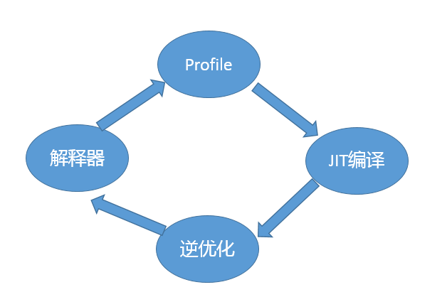
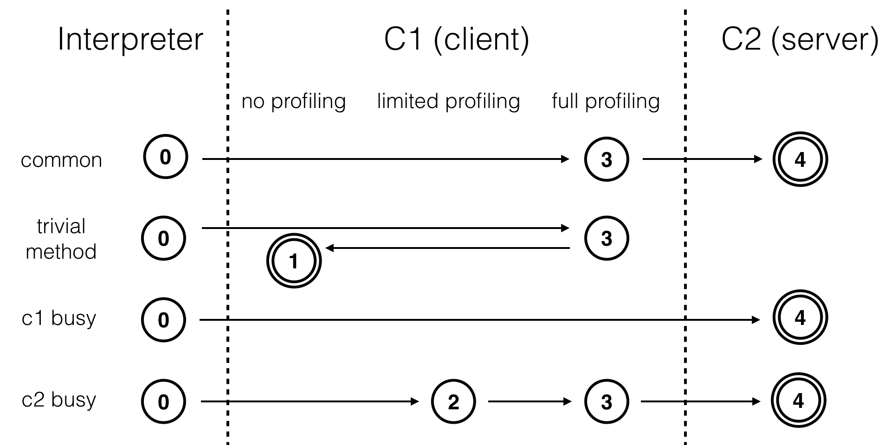

## 即时编译JIT的优化

java程序的优化是通过运行时即时编译jit实现的，javac编译成class文件过程中几乎不做任何优化。class的执行过程如下图，优化工作主要在即时编译器中执行。

jit是如何工作的？
从 Java 7 开始，HotSpot 默认采用分层编译的方式：热点方法首先会被 C1 编译，而后热点方法中的热点会进一步被 C2 编译。

分层编译，五个层级分别是：
- 解释执行；
- 执行不带 profiling 的 C1 代码；
- 执行仅带方法调用次数以及循环回边执行次数 profiling 的 C1 代码；
- 执行带所有 profiling 的 C1 代码；
- 执行 C2 代码。
不同的编译路径如下图：

这些耗费巨大代价收集而来的 profile 具体有什么作用呢？答案是，C2 可以根据收集得到的数据进行猜测，假设接下来的执行同样会按照所收集的 profile 进行，从而作出比较激进的优化。

JIT的优化手段主要由以下几种：

1. 方法内联：在编译过程中遇到方法调用时，将目标方法的方法体纳入编译范围之中，并取代原方法调用的优化手段。
对于虚方法的调用，需要去虚化后才能进行方法内联，去虚化技术包括：完全去虚化，条件去虚化

2. 基于热点代码profile的优化：根据方法调用次数和循环回边次数来把热点代码替换成机器码。
在即时编译中，一段代码执行的时间包括编译的时间+实际执行的时间，如果发大力气编译出来的代码，只执行少数几次，那么花在编译上的时间是浪费的。如果即时编译需要找出热点代码，把热点代码尽量优化编译。
想要机器码越快，需要的编译时间就越长。分层编译是一种折衷的方式，既能够满足部分不那么热的代码能够在短时间内编译完成，也能满足很热的代码能够拥有最好的优化。
即时编译是由方法调用计数器和循环回边计数器触发的。实际上，除了以方法为单位的即时编译之外，Java 虚拟机还存在着另一种以循环为单位的即时编译，叫做 On-Stack-Replacement（OSR）编译。循环回边计数器便是用来触发这种类型的编译的。
OSR 实际上是一种技术，它指的是在程序执行过程中，动态地替换掉 Java 方法栈桢，从而使得程序能够在非方法入口处进行解释执行和编译后的代码之间的切换。事实上，去优化（deoptimization）采用的技术也可以称之为 OSR。OSR 是一种能够在非方法入口处进行解释执行和编译后代码之间切换的技术。OSR 编译可以用来解决单次调用方法包含热循环的性能优化问题。

3. 基于逃逸分析的优化：
逃逸分析是“一种确定指针动态范围的静态分析，它可以分析在程序的哪些地方可以访问到指针”（出处参见[1]）。在 Java 虚拟机的即时编译语境下，逃逸分析将判断新建的对象是否逃逸。即时编译器判断对象是否逃逸的依据，一是对象是否被存入堆中（静态字段或者堆中对象的实例字段），二是对象是否被传入未知代码中。
即时编译器可以根据逃逸分析的结果进行诸如锁消除、栈上分配以及标量替换的优化。
- 锁消除：如果锁对象不逃逸，则不需要这个锁
- 栈上分配以及标量替换：如果对象不逃逸，则不用再堆上创建对象，只需在栈上创建即可。HotSpot 虚拟机并没有采用栈上分配，而是使用了标量替换：把对象里面的属性分解成一个个标量（基本类型），用这些标量来代替对象。

4. 基于分支 profile 的优化：分支跳转字节码的分支 profile（branch profile），包括跳转次数和不跳转次数。
5. 基于类型 profile 的优化：以及非私有实例方法调用指令、强制类型转换 checkcast 指令、类型测试 instanceof 指令，和引用类型的数组存储 aastore 指令的类型 profile（receiver type profile）。
和基于分支 profile 的优化一样，基于类型 profile 的优化同样也是作出假设，从而精简控制流以及数据流。这两者的核心都是假设。对于分支 profile，即时编译器假设的是仅执行某一分支；对于类型 profile，即时编译器假设的是对象的动态类型仅为类型 profile 中的那几个。

6. 基于特定CPU指令的优化
HotSpot 虚拟机将对标注了@HotSpotIntrinsicCandidate注解的方法的调用，替换为直接使用基于特定 CPU 指令的高效实现。这些方法我们便称之为 intrinsic。

7. 其他优化：
	- 字段访问相关优化
	- 死代码消除
	- 面向循环的编译优化方式：循环无关代码外提，循环展开，循环判断外提（loop unswitching）以及循环剥离（loop peeling）。
	- 向量化优化: 借助的是 CPU 的 SIMD 指令，即通过单条指令控制多组数据的运算。它被称为 CPU 指令级别的并行。