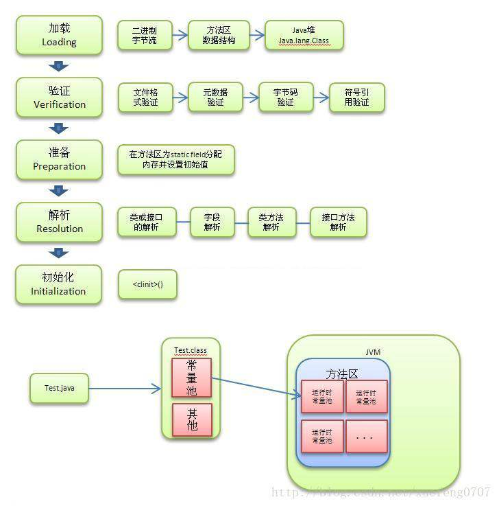
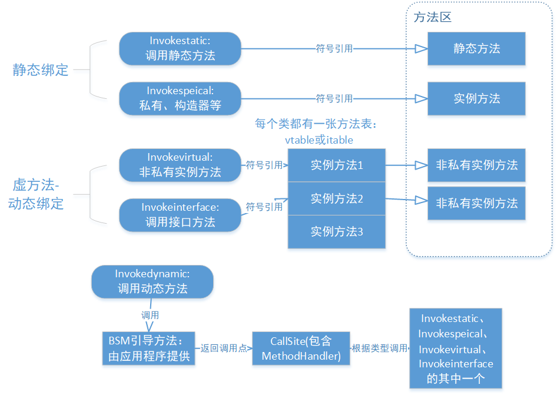
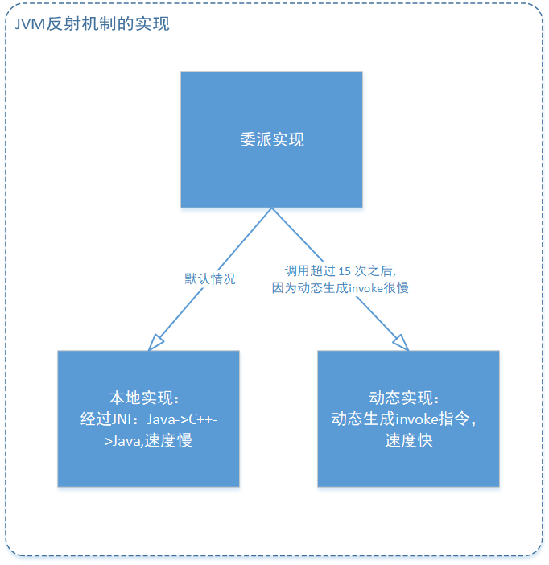
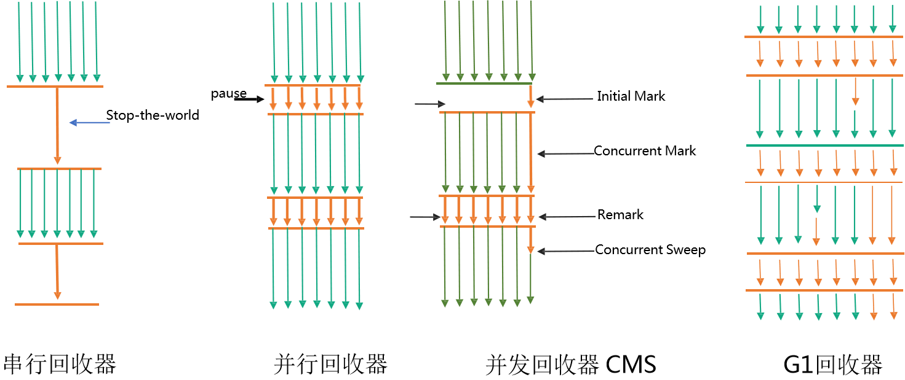
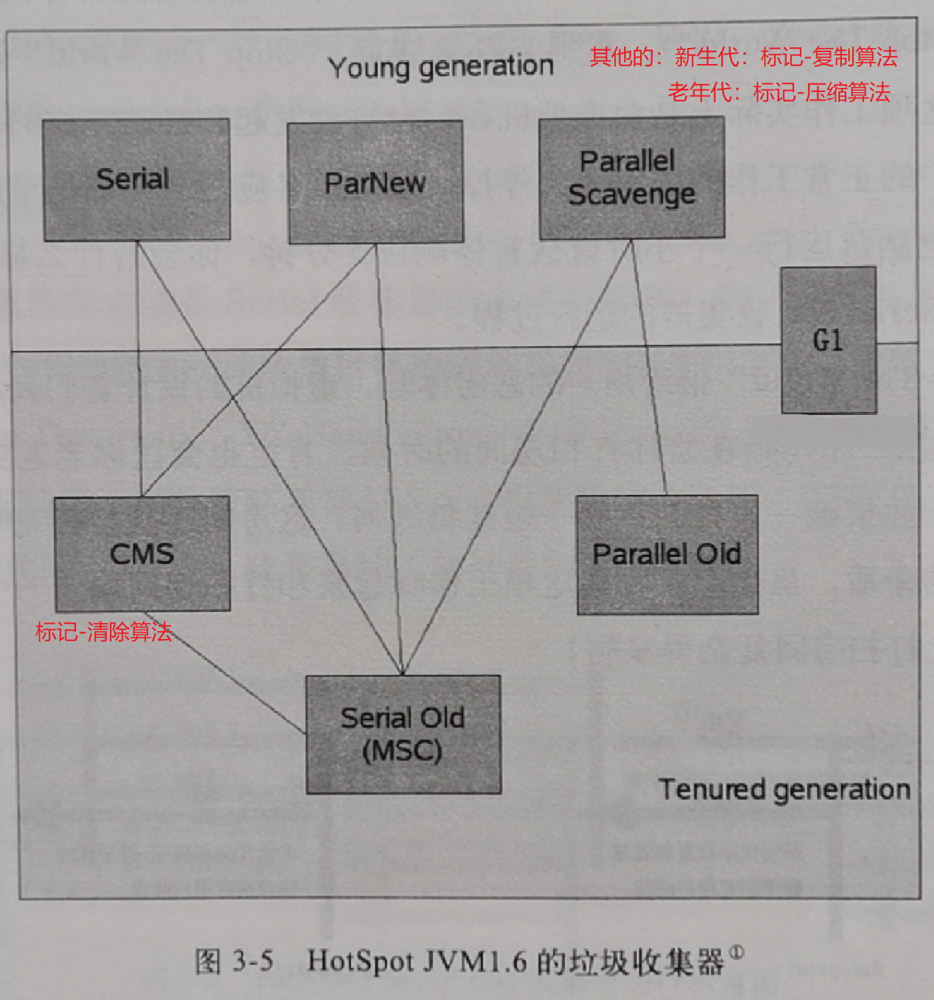
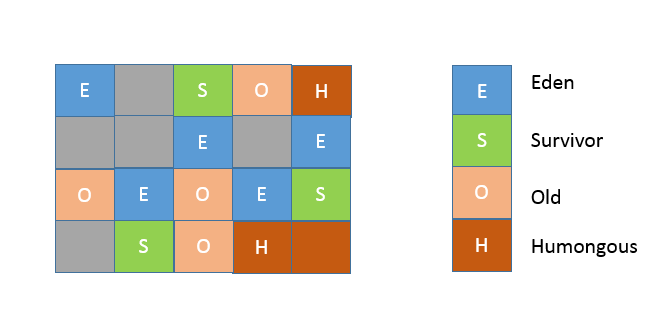

## jvm总结

jvm的内存分配：

jmm模型：

类加载过程
- 加载：查找字节流，并且据此创建类的过程。它是 Java 将字节码数据从不同的数据源读取到 JVM 中，并映射为 JVM 认可的数据结构（Class 对象）加载，是指
- 链接：链接，是指将创建成的类合并至 Java 虚拟机中，使之能够执行的过程。它可分为验证、准备以及解析三个阶段。这是核心的步骤，简单说是把原始的类定义信息平滑地转化入 JVM 运行的过程中。
- 初始化：类加载的最后一步是初始化，便是为标记为常量值的字段赋值，以及执行静态代码块。

在 Java 虚拟机中，类的唯一性是由类加载器实例以及类的全名一同确定的。即便是同一串字节流，经由不同的类加载器加载，也会得到两个不同的类。

Java 虚拟机与 Java 语言不同，它允许名字与参数类型相同，但返回类型不同的方法出现在同一个类中。
对于 Java 语言中重写而 Java 虚拟机中非重写的情况，编译器会通过生成桥接方法来实现 Java 中的重写语义。
由于对重载方法的区分在编译阶段已经完成，我们可以认为 Java 虚拟机不存在重载这一概念。因此，在某些文章中，重载也被称为静态绑定（static binding），或者编译时多态（compile-time polymorphism）；而重写则被称为动态绑定（dynamic binding）。
Java 字节码中与调用相关的指令共有五种。
- invokestatic：用于调用静态方法。
- invokespecial：用于调用私有实例方法、构造器，以及使用 super 关键字调用父类的实例方法或构造器，和所实现接口的默认方法。
- invokevirtual：用于调用非私有实例方法。
- invokeinterface：用于调用接口方法。
- invokedynamic：用于调用动态方法。这条新增加的指令是JDK 7实现“动态类型语言”（Dynamically Typed Language）支持而进行的改进之一，也是为JDK 8可以顺利实现Lambda表达式做技术准备。在Java 8中，在实现lambda表达式和默认方法时，底层会生成和使用invokedynamic。
当解释器（interpreter）遇到invokedynamic指令的时候，BSM(bootstrap method 引导方法)会被调用。它会返回一个对象（包含了一个方法句柄），这个对象表明了调用点要实际执行哪个方法。
invokedynamic 底层机制的基石：方法句柄。方法句柄是一个强类型的、能够被直接执行的引用。它仅关心所指向方法的参数类型以及返回类型，而不关心方法所在的类以及方法名。方法句柄的权限检查发生在创建过程中，相较于反射调用节省了调用时反复权限检查的开销。
invokedynamic 的目的，就是将调用点与目标方法的链接交由应用程序来做。

对于 invokestatic 以及 invokespecial 而言，Java 虚拟机能够直接识别具体的目标方法。而对于 invokevirtual 以及 invokeinterface 而言，在绝大部分情况下（除了final方法），虚拟机需要在执行过程中，根据调用者的动态类型，来确定具体的目标方法。

为改进虚方法调用的效率，即时编译还拥有另外两种性能更好的优化手段：
- 内联缓存（inlining cache）：缓存，使得不用再去查询方法表。
- 方法内联（method inlining）: 去掉方法调用。

Java 虚拟机是如何捕获异常的？
在编译生成的字节码中，每个方法都附带一个异常表。异常表中的每一个条目代表一个异常处理器，并且由 from 指针、to 指针、target 指针以及所捕获的异常类型构成。这些指针的值是字节码索引（bytecode index，bci），用以定位字节码。

当程序触发异常时，Java 虚拟机会从上至下遍历异常表中的所有条目。当触发异常的字节码的索引值在某个异常表条目的监控范围内，Java 虚拟机会判断所抛出的异常和该条目想要捕获的异常是否匹配。如果匹配，Java 虚拟机会将控制流转移至该条目 target 指针指向的字节码。

如果遍历完所有异常表条目，Java 虚拟机仍未匹配到异常处理器，那么它会弹出当前方法对应的 Java 栈帧，并且在调用者（caller）中重复上述操作。在最坏情况下，Java 虚拟机需要遍历当前线程 Java 栈上所有方法的异常表。

finally 代码块的编译比较复杂。当前版本 Java 编译器的做法，是复制 finally 代码块的内容，分别放在 try-catch 代码块所有正常执行路径以及异常执行路径的出口中。

jvm反射机制的实现：
inflation机制:在默认情况下，方法的反射调用为委派实现，委派给本地实现来进行方法调用。在调用超过 15 次之后，委派实现便会将委派对象切换至动态实现。这个动态实现的字节码是自动生成的，它将直接使用 invoke 指令来调用目标方法。

方法的反射调用会带来不少性能开销，原因主要有三个：变长参数方法导致的 Object 数组，基本类型的自动装箱、拆箱，还有最重要的方法内联导致的栈上分配。

GC中的相关算法：
- 标记算法:如何判断对象是否有用：引用计数法与可达性分析
目前 Java 虚拟机的主流垃圾回收器采取的是可达性分析算法。这个算法的实质在于将一系列 GC Roots 作为初始的存活对象合集（live set），然后从该合集出发，探索所有能够被该集合引用到的对象，并将其加入到该集合中，这个过程我们也称之为标记（mark）。最终，未被探索到的对象便是死亡的，是可以回收的。
GC Roots 包括（但不限于）如下几种：Java 方法栈桢中的局部变量；已加载类的静态变量；JNI handles；已启动且未停止的 Java 线程。
- 回收算法：清除（sweep），压缩（compact）（也叫整理），复制（copy）

结合起来就有：标记 - 复制算法，标记 - 清除算法，标记 - 压缩算法，

Card Table：在Minor GC的时候，老年代的对象也会引用到新生代，所以标记的时候，需要把老年代中的对象加入GC Roots，这样就需要全堆扫描了。HotSpot 给出的解决方案是一项叫做卡表（Card Table）的技术。该技术将整个堆划分为一个个大小为 512 字节的卡，并且维护一个卡表，用来存储每张卡的一个标识位。这个标识位代表对应的卡是否可能存有指向新生代对象的引用。如果可能存在，那么我们就认为这张卡是脏的。在进行 Minor GC 的时候，我们便可以不用扫描整个老年代，而是在卡表中寻找脏卡，并将脏卡中的对象加入到 Minor GC 的 GC Roots 里。当完成所有脏卡的扫描之后，Java 虚拟机便会将所有脏卡的标识位清零。

gc中串行，并行，并发的含义：
串行是指一个gc线程，并行是指多个gc线程，但用户线程和gc线程是分开执行的，并发是在多个线程的基础上，gc线程和用户进程同时进行，进一步减少stw的时间。

Serial收集器：串行运行；作用于新生代；复制算法；响应速度优先；适用于单CPU环境下的client模式。
ParNew收集器：并行运行；作用于新生代；复制算法；响应速度优先；多CPU环境Server模式下与CMS配合使用。
Parallel Scavenge收集器：并行运行；作用于新生代；复制算法；吞吐量优先；适用于后台运算而不需要太多交互的场景。

Serial Old收集器：串行运行；作用于老年代；标记-整理算法；响应速度优先；单CPU环境下的Client模式。
Parallel Old收集器：并行运行；作用于老年代；标记-整理算法；吞吐量优先；适用于后台运算而不需要太多交互的场景。
CMS收集器（Concurrent Mark Sweep）：并发运行；作用于老年代；标记-清除算法；响应速度优先；适用于互联网或B/S业务。

G1收集器：并发运行；可作用于新生代或老年代；标记-整理算法(老年代)+复制算法（新生代）；响应速度优先；面向服务端应用。

G1（Garbage First）是一个横跨新生代和老年代的垃圾回收器。实际上，它已经打乱了前面所说的堆结构，直接将堆分成极其多个区域。每个区域都可以充当 Eden 区、Survivor 区或者老年代中的一个。和 CMS 一样都能够在应用程序运行过程中并发地进行垃圾回收。

桥接方法的用处：
- 泛型擦除会造成子类对父类的重写语义失效，需要在子类增加一个桥接方法，这个桥接方法和父类的方法有重写语义
- java中父类和子类的同名同参数，但返回值类型不同是重写语义，而jvm中是重载语义。子类定义了一个与父类参数类型相同的方法，其返回类型为父类方法返回类型的子类，那么 Java 编译器也会为其生成桥接方法，以便实现重写语义。

Java虚拟机的监控及诊断工具：
- jps将打印所有正在运行的 Java 进程。
- jstat允许用户查看目标 Java 进程的类加载、即时编译以及垃圾回收相关的信息。它常用于检测垃圾回收问题以及内存泄漏问题。
- jmap允许用户统计目标 Java 进程的堆中存放的 Java 对象，并将它们导出成二进制文件。
- jinfo将打印目标 Java 进程的配置参数，并能够改动其中 manageabe 的参数。
- jstack将打印目标 Java 进程中各个线程的栈轨迹、线程状态、锁状况等信息。它还将自动检测死锁。
- jcmd则是一把瑞士军刀，可以用来实现前面除了jstat之外所有命令的功能。

GUI工具:
- eclipse MAT:解析jmap导出的虚拟机堆的二进制快照的工具。
- Java Mission Control（JMC）是 Java 虚拟机平台上的性能监控工具.它包含一个 GUI 客户端，以及众多用来收集 Java 虚拟机性能数据的插件，如 JMX Console（能够访问用来存放虚拟机各个子系统运行数据的MXBeans），以及虚拟机内置的高效 profiling 工具 Java Flight Recorder（JFR）。

GraalVM 是一个高性能的、支持多种编程语言的执行环境。它既可以在传统的 OpenJDK 上运行，也可以通过 AOT（Ahead-Of-Time）编译成可执行文件单独运行，甚至可以集成至数据库中运行。