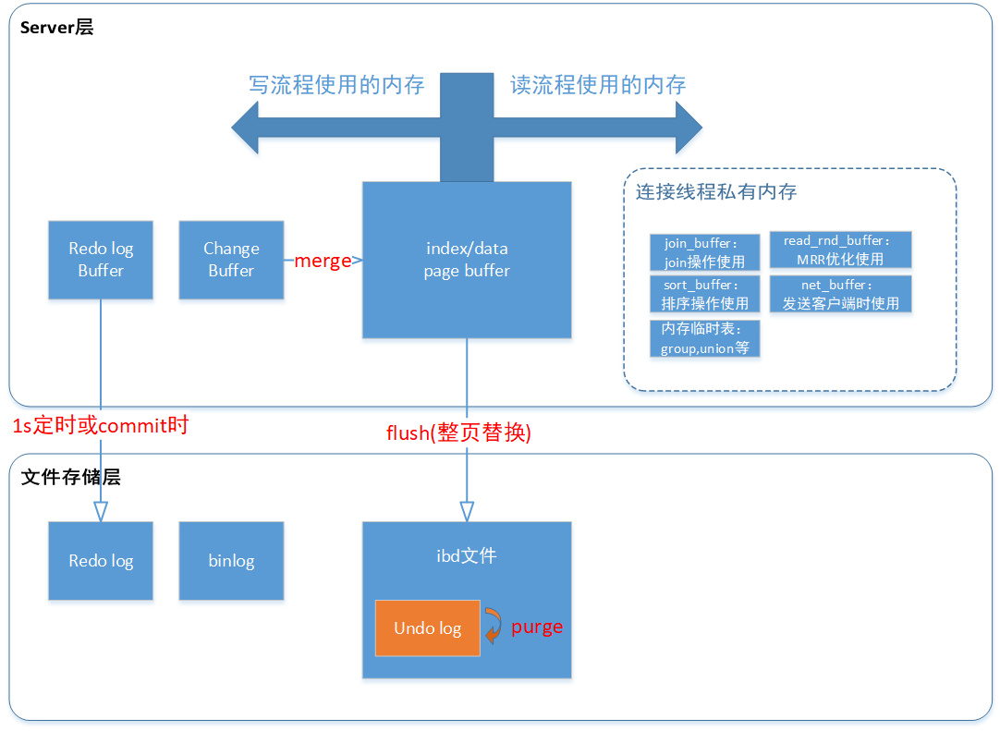
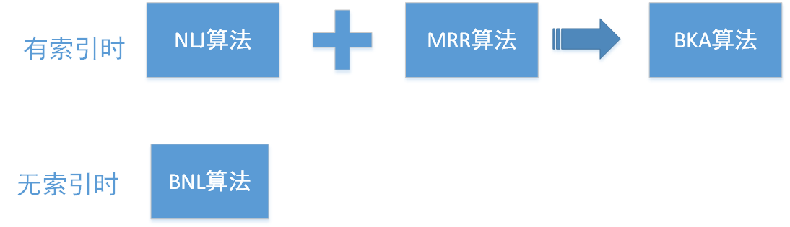

## mysql学习总结

### MySQL 的逻辑架构图：

### innodb查询一条数据的流程：

### innodb更新一条数据的流程：

最后三步：redo log采用两阶段提交。redo log 和 binlog 都可以用于表示事务的提交状态，而两阶段提交就是让这两个状态保持逻辑上的一致。

### mysql的线程：
与客户端io相关的线程：
- read thread：负责数据库读取操作，可配置多个读取线程。
- write thread：负责数据库写操作，可配置多个写线程。

后台线程：
- master thread：主要负责将脏缓存页刷新到数据文件，触发检查点等。
- change buffer thread：负责更改缓冲区的合并操作。
- redo log thread：用于将重做日志刷新到logfile中。
- undo log purge thread：净化线程，MySQL5.5之后用单独的purge thread执行- purge操作。
- lock thread：负责锁控制和死锁检测等

### 索引
mysql的索引分为hash索引和B+树索引，innnodb用的是B+树索引，分为主键索引（聚簇索引）和非主键索引（二级索引）。在非主键索引再查询，如果索引字段不能包含所有的查询字段，则需要回表查询，所以可以建立覆盖索引，以减少回表。
能不能利用上索引，用的是最左前缀原则。
索引下推优化：比如有个 name+age的联合索引，像 name like '张%' and age=10 这样的查询条件，如果没有索引下推优化功能，则只能用最左前缀原则，查到以'张'开头的行，然后回表，再判断age是否等于10；而有了索引下推优化，则可以在二级索引上查询以'张'开头同时age=10，然后再回表。

### 锁
mysql的锁：
- 全局锁：加全局读锁的方法，命令是 Flush tables with read lock (FTWRL)。当你需要让整个库处于只读状态的时候，可以使用这个命令
- 表级锁：一种是表锁，一种是元数据锁（meta data lock，MDL)。当对一个表做增删改查操作的时候，加 MDL 读锁；当要对表做结构变更操作的时候，加 MDL 写锁。
- 行级锁：行锁，间隙锁，next-key锁

两阶段锁协议:在 InnoDB 事务中，行锁是在需要的时候才加上的，但并不是不需要了就立刻释放，而是要等到事务结束时才释放。这个就是两阶段锁协议。根据这个协议，应该这样安排正确的事务语句顺序：如果你的事务中需要锁多个行，要把最可能造成锁冲突、最可能影响并发度的锁的申请时机尽量往后放。

### 视图概念
在 MySQL 里，有两个“视图”的概念：
- 一个是 view。它是一个用查询语句定义的虚拟表，在调用的时候执行查询语句并生成结果。创建视图的语法是 create view … ，而它的查询方法与表一样。
- 另一个是 InnoDB 在实现 MVCC 时用到的一致性读视图，即 consistent read view，也叫快照读，用于支持 RC（Read Committed，读提交）和 RR（Repeatable Read，可重复读）隔离级别的实现。

在可重复读隔离级别下，事务在启动的时候就“拍了个快照”。注意，这个快照是基于整库的。InnoDB 利用了“所有数据都有多个版本”的这个特性，实现了“秒级创建快照”的能力。这是通过undo log实现的。

更新数据都是先读后写的，而这个读，只能读当前的值，称为“当前读”（current read）。

可重复读的核心就是一致性读（consistent read）；而事务更新数据的时候，只能用当前读。
如果当前的记录的行锁被其他事务占用的话，就需要进入锁等待。
而读提交的逻辑和可重复读的逻辑类似，它们最主要的区别是：
- 在可重复读隔离级别下，只需要在事务开始的时候创建一致性视图，之后事务里的其他查询都共用这个一致性视图；
- 在读提交隔离级别下，每一个语句执行前都会重新算出一个新的视图。

获取快照读时，会构造了一个数组，用来保存当前未提交的事务列表:
- 如果一个row的trx_id处于绿色部分(包括当前事务)，表明是自己更新的或者是已提交的事务更新的，可见。
- 如果一个row的trx_id处于红色部分，表示这个版本是由将来启动的事务生成的，是肯定不可见的；
- 如果一个row的trx_id是处于黄色部分(不包括当前事务)，表示这个版本是由还没提交的事务生成的，不可见；

### change buffer作用
change buffer：当需要更新一个数据页时，如果数据页在内存中就直接更新，而如果这个数据页还没有在内存中的话，在不影响数据一致性的前提下，InnoDB 会将这些更新操作缓存在 change buffer 中，这样就不需要从磁盘中读入这个数据页了。
将 change buffer 中的操作应用到原数据页，得到最新结果的过程称为 merge。除了访问这个数据页会触发 merge 外，系统有后台线程会定期 merge。在数据库正常关闭（shutdown）的过程中，也会执行 merge 操作。

### explain的extra的含义：
- Using index：仅使用索引树中的信息从表中检索列信息，不需要回表。
- Using index condition:先用索引后找到所有符合索引条件的数据行，随后用 WHERE子句中的其他条件去过滤这些数据行；
- Using where:表示Mysql将对storage engine提取的结果进行过滤，过滤条件字段无索引；
- Using temporary：为了解决查询，MySQL需要创建一个临时表来容纳结果。
- Using filesort：表示需要排序操作，无法利用索引完成排序操作。需要分配一块sort_buffer来完成排序，如果sort_buffer不足，则需要临时文件来完成排序。
- Using join buffer (Block Nested Loop), Using join buffer (Batched Key Access):
- Using MRR:使用MRR策略优化表数据读取

### redolog的checkpoint往前推进的流程。
https://www.cnblogs.com/f-ck-need-u/archive/2018/05/08/9010872.html
LSN（log sequence number）日志序列号，是日志的逻辑序列号。LSN的值是日志空间中每条日志的结束点，用字节偏移量来表示。每个page有LSN，redo log也有LSN，Checkpoint也有LSN。
redo log从checkpoint到write pos可以看做是一个日志列表，其中每条日志的LSN按顺序递增。当redo log写满时，需要往前推进checkpoint，取出一条日志，得到日志的LSN，此时可以检查此LSN对应的页是否已经刷盘，没刷的话就刷盘，然后往前推进取出下一个LSN。
当buffer pool不足需要淘汰一些页面时，使用LRU算法得到要淘汰的页面，如果是脏页，则直接刷盘即可，不用对redo log有任何的操作。
当数据库crash，重启需要恢复时，则从redo log的checkpoint开始，一条条分析，检查对应的页是不是最新页，不是的话，就应用redo日志把它变成最新的。

**以上流程的一个关键点是，从checkpoint开始取出一条redo日志，如何知道此日志对应的是哪个页？在crash恢复时，如何判断对应的数据页是不是最新的？**

林晓彬回答：
其实由于淘汰的时候，刷脏页过程不用动redo log文件的。
这个有个额外的保证，是redo log在“重放”的时候，如果一个数据页已经是刷过的，会识别出来并跳过。

### 为什么innodb不把表格的总行数记录下来？在count(*)的时候直接返回
因为即使是在同一个时刻的多个查询，由于多版本并发控制（MVCC）的原因，InnoDB 表“应该返回多少行”也是不确定的。

### 崩溃恢复时的判断规则
1. 如果 redo log 里面的事务是完整的，也就是已经有了 commit 标识，则直接提交；
2. 如果 redo log 里面的事务只有完整的 prepare，则判断对应的事务 binlog 是否存在并完整：binlog和redolog的关联是通过它们的一个共同的数据字段，叫XID
	- a. 如果是，则提交事务；
	- b. 否则，回滚事务。

### 排序算法：
当无法使用索引排序，extra有Using filesort时，需要使用内存sort_buffer来执行排序，算法有两种：
- 全字段排序：把每行需要返回的字段都取出来，放到sort_buffer,执行排序算法，然后返回。如果内存不够，则需要借助文件，使用归并排序。  
- rowid 排序：如果以上算法效率低的话，则mysql会使用rowid排序：把每行id和排序字段取出来放sort_buffer，执行排序，然后用id去取出需要返回的字段。

如果 MySQL 实在是担心排序内存太小，会影响排序效率，才会采用 rowid 排序算法，这样排序过程中一次可以排序更多行，但是需要再回到原表去取数据。如果 MySQL 认为内存足够大，会优先选择全字段排序，把需要的字段都放到 sort_buffer 中，这样排序后就会直接从内存里面返回查询结果了，不用再回到原表去取数据。这也就体现了 MySQL 的一个设计思想：如果内存够，就要多利用内存，尽量减少磁盘访问。

### 可重复度级别下的innodb枷锁规则：
包含了两个“原则”、两个“优化”和一个“bug”。
- 原则 1：加锁的基本单位是 next-key lock。希望你还记得，next-key lock 是前开后闭区间即：(a,b]。
- 原则 2：查找过程中访问到的对象才会加锁。
- 优化 1：索引上的等值查询，给唯一索引加锁的时候，next-key lock 退化为行锁。
- 优化 2：索引上的等值查询，向右遍历时且最后一个值不满足等值条件的时候，next-key lock 退化为间隙锁。
- 一个 bug：唯一索引上的范围查询会访问到不满足条件的第一个值为止。

### binlog的格式
- statement:有些语句可能导致主备不一致
- row：把行数据记录下来
- mixed：MySQL 自己会判断这条 SQL 语句是否可能引起主备不一致，如果有可能，就用 row 格式，否则就用 statement 格式。

GTID 的全称是 Global Transaction Identifier，也就是全局事务 ID，是一个事务在提交的时候生成的，是这个事务的唯一标识。

### 读写分离处理过期读问题
- 强制走主库方案：对于必须要拿到最新结果的请求，强制将其发到主库上；对于可以读到旧数据的请求，才将其发到从库上。
- Sleep 方案：主库更新后，读从库之前先 sleep 一下。
- 判断主备无延迟方案：查询seconds_behind_master或GTID，确保无延迟
- semi-sync：从库收到 binlog 以后，发回给主库一个 ack，主库才给客户端返回“事务完成”的确认。

### Buffer Pool淘汰算法
innodb使用的是改进的LRU算法，按照 5:3 的比例把整个 LRU 链表把LRU内存区域分为young和old区域。需要新插入的数据页，都被放到 old 区域，处于 old 区域的数据页，若这个数据页在 LRU 链表中存在的时间超过了 1 秒，就把它移动到old区链表头部，否则位置保持不变。

### JOIN的执行过程
- 连接字段有索引的话：使用Index Nested-Loop Join，简称 NLJ。即先从驱动表取一行，再从被驱动表判断有没有符合条件的行。
- 连接字段有索引的话：使用Block Nested-Loop Join的算法，简称 BNL。把驱动表的数据全部载入join_buffer，然后扫描被驱动表，把每一行取出来，跟 join_buffer 中的数据做对比。
- Multi-Range Read 优化，主要目的是尽量使用顺序读盘：查出多个id放在read_rnd_buffer，把id排序之后，依次到主键 id 索引中查记录，并作为结果返回。
- Batched Key Access：BKA 算法，其实就是对 NLJ 算法的优化。NLJ+MRR=BKA
- 对BNL算法的改进，只能人工进行，对连接字段加上索引，使其变成BKA算法。

### 临时表的特点和使用
临时表是连接私有的，即不同连接可以创建同名的临时表。
临时表的应用场景有：
- union执行流程，用作排重；
- group by 执行流程，用作保存分组的临时结果。不过group by字段如果有索引话，可以不用创建临时表，直接使用索引进行分组。

如果语句执行过程可以一边读数据，一边直接得到结果，是不需要额外内存的，否则就需要额外的内存，来保存中间结果；join_buffer 是无序数组，sort_buffer 是有序数组，临时表是二维表结构；如果执行逻辑需要用到二维表特性，就会优先考虑使用临时表。比如我们的例子中，union 需要用到唯一索引约束， group by 还需要用到另外一个字段来存累积计数。

### 用户权限分类：
- 全局权限：作用于整个 MySQL 实例，权限信息保存在 mysql 库的 user 表里。内存里，存在数组 acl_users中。
- db 权限：基于库的权限记录保存在 mysql.db 表中，在内存里则保存在数组 acl_dbs 中。
- 表权限和列权限:表权限定义存放在表 mysql.tables_priv 中，列权限定义存放在表 mysql.columns_priv 中。这两类权限，组合起来存放在内存的 hash 结构 column_priv_hash 中。
当使用grant修改用户的权限时，也会同时修改内存中的权限数据，所以没必要随后执行 flush privileges 语句的。
flush privileges 语句本身会用数据表的数据重建一份内存权限数据，所以在权限数据可能存在不一致的情况下再使用。而这种不一致往往是由于直接用 DML 语句操作系统权限表导致的，所以我们尽量不要使用这类语句。

### 分区表：
分区表对于引擎层来说是多个表；对于Server层来说是1个表。
分区表的一个显而易见的优势是对业务透明，相对于用户分表来说，使用分区表的业务代码更简洁。还有，分区表可以很方便的清理历史数据。

### explain 的type类型的理解
|类型|	解释
|:-:|:-:|
|  ALL              |  全表扫描
|  index            |  索引全扫描
|  range            |  索引范围扫描，常用语<,<=,>=,between等操作
|  ref                |  使用非唯一索引扫描或唯一索引前缀扫描，返回单条记录，常出现在关联查询中
|  eq_ref           |  类似ref，区别在于使用的是唯一索引，使用主键的关联查询
|  const/system  |  单条记录，系统会把匹配行中的其他列作为常数处理，如主键或唯一索引查询
|  null                |  MySQL不访问任何表或索引，直接返回结果

### mysql主从复制方式：
- 异步复制：提交线程和复制线程是独立的，速度最快，但是如果有主从延迟且master宕机可能丢数据。
- 同步复制：主节点等待操作日志成功复制到所有从节点上之后，再返回成功。不会丢数据，但速度很慢，几乎没法用
- 半同步复制：主节点等待操作日志最少成功复制到 N 个从节点上之后，再更新状态。速度和安全的平衡，一般配置为1个从节点成功。

### 复制状态机理论：
状态机复制的理论基础是：如果集群里的每一个节点上都运行着相同的确定性状态机S，并且所有的状态机刚开始都处于同样的初始状态s0，那么给予这些状态机相同的输入序列: {i1, i2, i3, i4, i5, i6, …, in}, 这些状态机必然会经过相同的状态转换路径: s0->s1->s2->s3->…->sn最终达到相同的状态sn, 同时生成相同的输出序列 {o1(s1), o2(s2), o3(s3), …, on(sn)}。
状态机复制在实际应用中的一个例子就是MySQL集群。

在执行输入序列I的过程中，根据同步方式的不同，系统就有了强一致性和最终一致性。如果我们要求对于序列I中的每一个in, 都需要所有的服务副本确认成功执行了in，才能执行in+1，那么这个系统就是强一致性的系统,这就是同步复制。如果我们取消掉这个限制，仅仅要求所有的服务副本执行相同的输入序列I，但是完全各自独立执行，而不需要在中间同步，那么就有了最终一致性，这就是异步复制。
